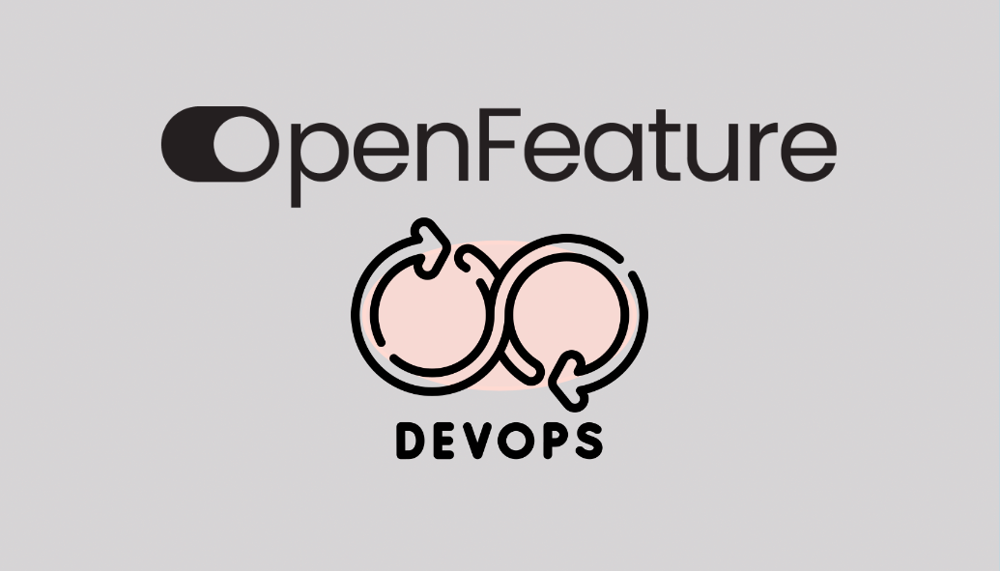

---
tags:
- DevOps
- Feature Toggle
- Deployment Strategy
---
# 用Feature Toggle實現簡單、有彈性並較少資源成本的部署策略


將新版本軟體交付給用戶時，擁有不同的部署策略對於保證以高效率且穩健的方式是非常重要的。 在閱讀完其他文章後，我們可以整理出如下總結（如果您對部署策略不熟悉，請參閱[baeldung blog](https://www.baeldung.com/ops/deployment-strategies)或[plutora blog](https://www.plutora.com/blog/deployment-strategies-6-explained-in-deep)複習一下）：

**Recreate Deployment** 最簡單，但可能會導致服務停機並向所有使用者暴露潛在的 Bug。 其他（**Blue/Green, Rolling, A/B測試, Shadow, Canary**…）可以保證零停機時間，其中一些使用更多的資源（Memory, CPU 等硬體資源…）及複雜的設定來實現在同一時間運行兩個版本的應用程式，來達到同時為 Release 提供更多信心或更容易回滾到舊版本。

然而，我們不應該將硬體資源視為免費或無限的，尤其像現在整個軟體行業陷入困難時。正如[*Pete Hodgson*](https://thepete.net/)在他的文章中所說（[Feature Toggle](https://martinfowler.com/articles/feature-toggles.html)），我們可以使用Feature Toggle系統來執行部署策略，這可以**節省一些資源**。此外，**還可以消除為策略設置CD工具或網路相關元件**（像是Load Balancer等）的繁雜工作（對於一些不熟悉DevOps或SRE知識的開發人員）。唯一剩下的工作就是設置Toggle和寫一些程式（可使用`if/else`或`switch`輕鬆完成）。

在這篇文章中，我們將介紹：

1. Feature Toggle需要哪些功能來實現這一點？
2. 如何使用Feature Toggle執行不同的部署策略（Blue/Green部署、A/B測試、Canary Release、Shadow部署…）？ 
3. 如何最小化Feature Toggle的維護工作？

這是為本文所寫的範例GitHub Repository [open-feature-openflagr-example](https://github.com/NoahHsu/open-feature-openflagr-example)，歡迎訪問並留下任何評論。

--- 

## Feature Toggle 系統的需求
在考慮採用Feature Toggle而不是複雜的發佈策略時，可以先看看網路上提供的開源版或企業級Feature Toggle（[Unleash](https://www.getunleash.io/?utm_source=theproductmanager.com&utm_medium=cpc&utm_campaign=Demand_052023&utm_content=BestFeatureFlags)，[Flagsmith](https://flagsmith.com/?utm_source=list&utm_medium=cpc&utm_campaign=productmanagerlist)，[Flagr](https://github.com/openflagr/flagr)，[LaunchDarkly](https://launchdarkly.com/) 等），並選擇一個具有以下特點和最低要求的Feature Toggle：

1. **動態評估API並支持高RPS**：Feature Toggle在通過其API評估Toggle狀態時應有效處理高RPS負載（通過API獲取Toggle是否打開/關閉），因為Toggle應該在最小程度上影響核心業務性能。
2. **動態設定和持久化**：Feature Toggle系統應允許通過UI或API動態調整設定。另外它也得確保設定更改後能持久存在，保證系統在重新啟動前後有一致的行為。
3. Toggle評估API應提供以下功能：
    - **支援請求鍵值 (ID)**：基於請求中的鍵值去決定 Toggle 的評估結果（例如使用 Hash 算法來做到機率分布式的 Toggle)，並確保相同的鍵值總是獲得相同的結果。
    - **支援評估請求的 Body 內容**：可以設置規則以決定 Toggle 的評估結果（例如：當請求的Body中有個屬性`region`=Asia時Toggle開啟；=Europe時Toggle關閉）。

以上是將用Feature Toggle來替代部署策略的最低系統要求。如此一來，我們可以將流量設作業轉移到我們的程式開發工作中，還能與功能一起發出 Pull Request (PR) 讓 同事一起進行 Code Review。

---

## 使用Feature Toggle的部署策略
在這部分中，我們將展示如何**設定Toggle**（以Flagr為例），並demo在簡單情況下**程式碼片段**的實作方式（我在demo中使用最單純的`if/else`或`switch`，在實際專案中可以考慮用策略模式或其他更優雅的方式去寫）。首先，我們將從最簡單的**Toggle開啟/關閉**開始，執行 **Blue/Green 部署**或 **Shadow 部署**。接著應用基於百分比的滾動設置在Toggle上以實現 **Canary Release**。最後加上條件規則去根據請求的Body內容決定結果以實現 **A/B 測試**。

給定以下的程式碼片段（v1 會印出藍色的o; v2 會印出綠色的x）共用於接下來的 demo：

```java
public static String v1Feature() {
    return BLUE + "o" + RESET;
}

public static String v2Feature() {
    return GREEN + "x" + RESET;
}
```

### Blue/Green 部署 (toggle: 啟用/停用)

首先要達成 **Blue/Green部署** ，Toggle的設定如下非常簡單：


而對應的程式碼如下所示：

``` java
boolean toggleOn = client.getBooleanValue(FLAG_KEY, false, ctx);

String message;
if (toggleOn) {
    message = v2Feature();
    v2++;
} else {
    message = v1Feature();
    v1++;
}
System.out.print(message);
```

一開始我將開關設定為關閉，然後在程式執行期間將其打開。我們可以看到應用程式正如我們預期的那樣，在兩個功能之間順利切換。


這樣一來，我們就可以**節省很多硬體資源，因為我們無需維護完全不同的兩個環境（藍色和綠色）** 來運行不同版本的應用程式。

### Shadow 部署 (toggle: 啟用/停用)
在這個例子中，我們可以與 Blue/Green 佈署共享相同的 Toggle 設定，但首先將 Toggle 預設開啟。以下是**Shadow部署**的程式碼：

```java
String version = client.getStringValue(FLAG_KEY, "off", ctx);

String message = "";
message = v1Feature();
v1++;
if (version.equalsIgnoreCase("on")) {
    Thread newThread = new Thread(() -> {
        atomicString.accumulateAndGet(v2Feature(), String::concat);
        v2.getAndIncrement();
    });
    newThread.start();
}
System.out.print(message);
```

一開始，我們將同時調用 v1 和 v2 功能，假設在 v2 功能中發現了一些問題，就可以在程式執行期間將 Toggle 關閉。我們可以看到在 toggle 關閉後 v2 功能就不會再被呼叫。


使用Toggle系統執行Shadow部署是一種**有效且高度靈活的**方式。只要我們在程式碼中增加一些複雜性，稍微小心一點處理非同步程式的部分即可。

### Canary Release (toggle: 基於百分比的滾動部署)
讓我們將機率分佈功能加入 Toggle 的設定以進行Canary Release。


以下是Canary部署的程式碼：

```java
...
UUID userId = UUID.randomUUID();
MutableContext ctx = new MutableContext(userId.toString());

String version = client.getStringValue(FLAG_KEY, "v1", ctx);

String message = "";
switch (version) {
    case "v1" -> {
        message = v1Feature();
        v1++;
    }
    case "v2" -> {
        message = v2Feature();
        v2++;
    }
}
System.out.print(message);
...
```

給定一開始設定的分佈比例為 3:1（v1=75%; v2=25%），並且由於我們給每個請求分配了不同的鍵值 (ID) `targetKey`，我們將獲得一個非常接近給定分佈的結果。


若是我們程式都給定相同的 `targetKey=tester`，結果將保持不變，因為被Hash到相同的結果（在這個例子中是v2）。


因此，我們可以說使用Toggle系統進行 Canary Release 非常簡單易懂。只要我們認為新功能足夠穩定，我們隨時可以更改百分比，以便進行下一個階段的部署分佈。

### A/B Testing (toggle: 條件規則根據請求的 Body內容)

最後，我們來實作 A/B 測試。 透過對 Toggle 系統加上條件去根據請求的 Body 內容決定結果，如下所示。


而程式碼則需多給出 `context` 帶有 `region` 這個屬性，如下所示：

``` java
UUID userId = UUID.randomUUID();
MutableContext ctx = new MutableContext(userId.toString());
ctx.add("region", region);

String version = client.getStringValue(FLAG_KEY, "v1", ctx);

String message = "";
switch (version) {
    case "v1" -> {
        message = v1Feature();
        v1++;
    }
    case "v2" -> {
        message = v2Feature();
        v2++;
    }
}
System.out.print(message);
```

預期所有來自亞洲的使用者應該使用 v1 功能，而來自歐洲的使用者應該使用 v2，而其他地區使用者應該分一半一半的使用功能。正如我們在 console log 中所看到的，結果就如同前面所預期的。


由於我們可以動態調整條件規則，這使得在生產環境中進行功能實驗或部分人員優先測試等常見的測試方法變得**極其靈活且容易控制**。

---

## 最小化 Toggle 維護工作

隨著產品開發週期的持續進展，Toggle 相關的程式碼片段將散佈在整個程式碼庫，甚至更糟的是可能分佈在多個 Repository 中。之後程式碼就會看起來一團亂，開發人員很容易在Toggle 邏輯和核心業務邏輯中迷失方向。
此外，我們也有機會發現所選擇的 Toggle 系統未達到我們的期望功能、操作不方便、或者引起安全擔憂，進而需要轉移到另一個 Toggle 系統。

為了應對這些複雜性，額外抽出 Toggle 邏輯的抽象層是非常有需要的，能夠幫助應用程式優雅地執行 Toggle 評估。因此[OpenFeature 規範](https://openfeature.dev/docs/reference/intro/)應運而生。

這邊我們不會深入討論 OpenFeature (可以到[官網]((https://openfeature.dev/docs/reference/intro/))看到詳細的介紹)，但這裡是一些我們應該知道的基本概念與使用方法：

### 實作 Client 
- 開發一個 XxxClient（即 flagrClient），或使用 toggle 系統提供的 SDK 作為 API Client，用來向 Toggle 系統發送請求。

  ``` java title="OpenFlagrClient.java"
  public interface OpenFlagrClient {

    String BASE_PATH = "/api/v1/";

    @RequestLine("POST " + BASE_PATH + "evaluation")
    @Headers("Content-Type: application/json")
    V1EvaluationResponse evaluate(V1EvaluationRequest request);

  }
  ```
  
- 開發一個 [XxxFeatureProvider](https://github.com/open-feature/java-sdk/blob/d5a9867365d62bda51b87ff1d13e4f4daaee87cd/src/main/java/dev/openfeature/sdk/FeatureProvider.java#L11)(Xxx可以是我們所選用的 Toggle 系統名稱)，他已經列出了常見的（或可能更合理）即時切換評估邏輯的使用方式。

  ``` java title="OpenFlagrProvider.java"
  public class OpenFlagrProvider implements FeatureProvider {
  ...
    public ProviderEvaluation<Boolean> getBooleanEvaluation(String key, 
             Boolean defaultValue, EvaluationContext ctx) {

        V1EvaluationRequest request = buildRequest(key, ctx);

        V1EvaluationResponse response = flagrClient.evaluate(request);
        String answerVariant = response.variantKey() == null
                ? ""
                : response.variantKey().toLowerCase();
        boolean isOn = defaultOnToggleKeys.contains(answerVariant);

        return ProviderEvaluation.<Boolean>builder()
                .value(isOn)
                .variant(response.variantKey())
                .build();
    }

    @Override
    public ProviderEvaluation<String> getStringEvaluation(String key, 
             String defaultValue, EvaluationContext ctx) {
        V1EvaluationRequest request = buildRequest(key, ctx);
        V1EvaluationResponse response = flagrClient.evaluate(request);
        String answerVariant = response.variantKey() == null
                ? ""
                : response.variantKey();

        return ProviderEvaluation.<String>builder()
                .value(answerVariant)
                .build();
    }
  ... there are a lot of other methods

  }
  ```
### 設定 Client 與 OpenFeature
開發完 `Client` 後，將 XxxFeatureProvider 設定到 [OpenFeatureAPI](https://github.com/open-feature/java-sdk/blob/d5a9867365d62bda51b87ff1d13e4f4daaee87cd/src/main/java/dev/openfeature/sdk/OpenFeatureAPI.java)的 Instance 上，這個 [SPI設計](https://en.wikipedia.org/wiki/Service_provider_interface) 是為了若具有多個不同的 FeatureProvider 時可以透過名稱設定/取得。這邊由於我以 Spring Boot 當作範例，因此我建立了一個 Class 來包含 `OpenFeatureAPI` 的 Instance。

``` java title="FeatureToggleApiProvider.java"
public class FeatureToggleApiProvider implements InitializingBean {
    @Autowired
    FlagrClient flagrClient;

    OpenFeatureAPI api = OpenFeatureAPI.getInstance();

    @Override
    public void afterPropertiesSet() throws Exception {
        OpenFlagrProvider openFlagrProvider = new OpenFlagrProvider(flagrClient);
        api.setProvider(openFlagrProvider);
    }

    public Client getFlagrApiClient() {
        return api.getClient();
    }

}
``` 

### 使用 OpenFeature
最後其他模組與業務邏輯程式就可以利用這個 `OpenFlagrProvider` 透過取得 [Client](https://github.com/open-feature/java-sdk/blob/d5a9867365d62bda51b87ff1d13e4f4daaee87cd/src/main/java/dev/openfeature/sdk/Client.java) 介面（不是直接呼叫 XxxClient 的呼叫 API 方法 ，而是透過實作的 [OpenFeatureClient](https://github.com/open-feature/java-sdk/blob/d5a9867365d62bda51b87ff1d13e4f4daaee87cd/src/main/java/dev/openfeature/sdk/OpenFeatureClient.java) 這個介面，它將使用給定的[XxxFeatureProvider](https://github.com/open-feature/java-sdk/blob/d5a9867365d62bda51b87ff1d13e4f4daaee87cd/src/main/java/dev/openfeature/sdk/FeatureProvider.java#L11)再去呼叫對應的 XxxClient)，最終使用的程式碼 如下:

``` java
Client client = featureToggleApiProvider.getFlagrApiClient();

String version = client.getStringValue(FLAG_KEY, "v1", ctx);
// or 
boolean toggleOn = client.getBooleanValue(FLAG_KEY, false, ctx);
```

### 好處在哪？
以上是對 OpenFeature 一個大致的介紹，說明如何透過 OpenFeature 規範整合 Toggle 系統（詳細內容和完整程式碼請參考我的 [GitHub Repo](https://github.com/NoahHsu/open-feature-openflagr-example/tree/main/client/src/main/java/org/example/open/feature/openflagr/client)）。切換邏輯被提取到另一個抽象層，**主要應用程式保持專注於核心業務和部署策略**。即使有一天我們需要更改 Toggle 系統，應用程式也不需要任何更改，因為我們只需要開發新的 XxxClient 和 XxxFeatureProvider（甚至已經有別人開發好或官方出的版本，所以根本不需要開發工作，可以先找看看 [OpenFeature 生態系/ Market Place](https://openfeature.dev/ecosystem)）。

---

## 總結
在這篇文章中，首先我們談到了當想要利用 Feature Toggle 來實現**更靈活、更容易且更低成本的方式進行不同的部署策略時所需要的三個重點功能**：第一，是我們的 Toggle 系統應該能夠進行**具有持久性的動態設定**、第二，要能提供**高效的動態評估方法**、第三，評估 API 時應該**支援根據請求的 Body 的鍵值 (ID) 和屬性條件去產生結果**。接著我們展示了不同種類部署策略下的 Toggle 設定和實作程式碼片段。最後介紹了**OpenFeature 規範抽象層**，使程式碼庫保持整潔，更易於維護和且保有更換的彈性。

### 參考資料

- [https://www.baeldung.com/ops/deployment-strategies](https://www.baeldung.com/ops/deployment-strategies)
- [https://www.plutora.com/blog/deployment-strategies-6-explained-in-depth](https://www.plutora.com/blog/deployment-strategies-6-explained-in-depth)
- [https://martinfowler.com/articles/feature-toggles.html](https://martinfowler.com/articles/feature-toggles.html)
- [https://en.wikipedia.org/wiki/Service_provider_interface](https://en.wikipedia.org/wiki/Service_provider_interface)