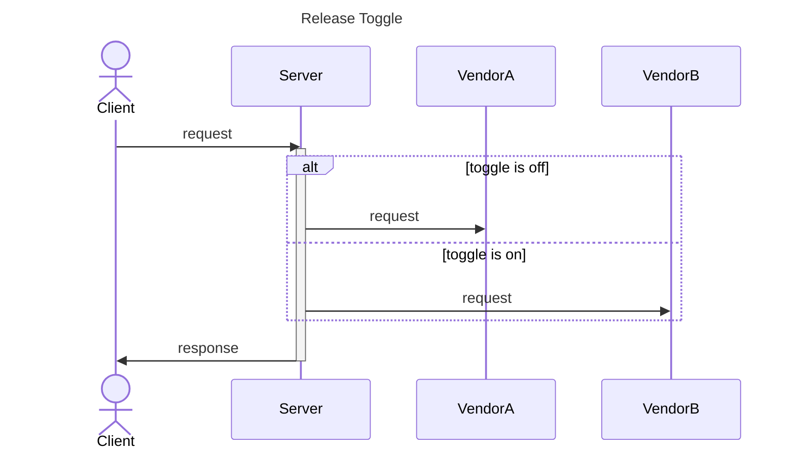
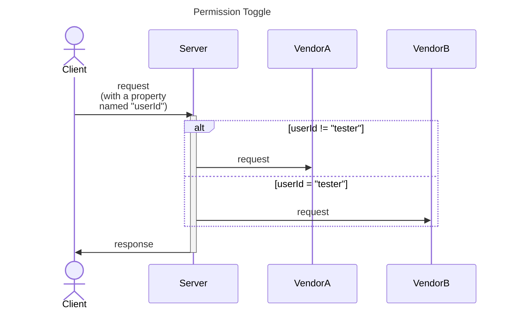
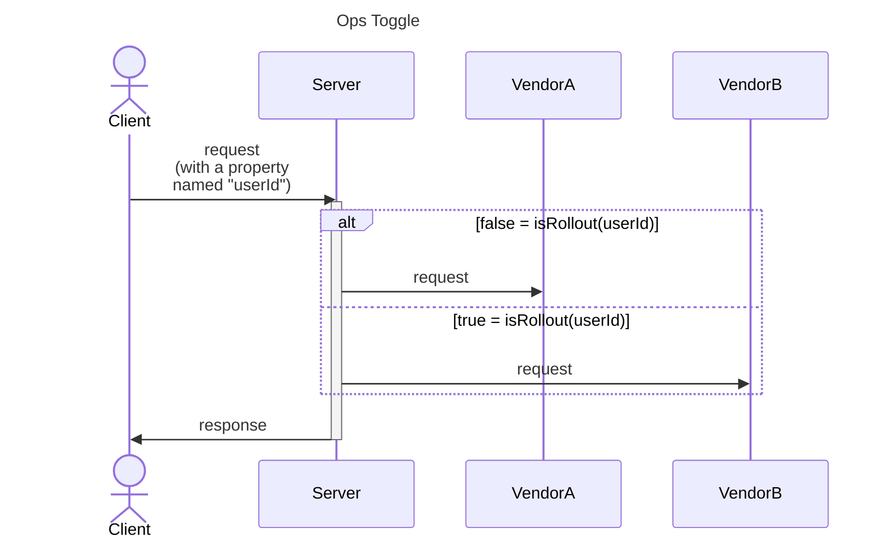
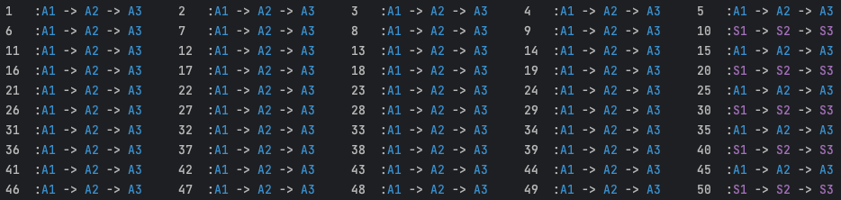

# Safely Deliver Large Scale Feature Migration With Feature Toggle

Large-scale Change (LSC) within software development often presents massive challenges. It's a scenario that needs careful planning to meet the need for stability. As DevOps philosophy evolves at a rapid pace, seamless implementation, testing, and release of these changes becomes necessary. This is why feature toggles emerge as a valuable tool, offering a variety of strategies to manage, test, and deploy large-scale changes effectively.

In this article, we will mainly describe how to develop, test, and release an LSC safely with feature toggles. Starting from the definition of LSC, why it needs help from feature toggle, and what kind of LSC can be covered. Next, we will introduce what kind of toggle we will use, and brief the migration schedule. Finally, we will show what to do with the code and toggle settings during the development, testing, and release stages with an easy demo. Let's begin! 


## Large Scale Change
What's a Large-Scale Change (LSC)? the definition in the book [Software Engineering at Google](https://www.oreilly.com/library/view/software-engineering-at/9781492082781/ch22.html) is like, a change that should be a single commit logically, due to some constraints (merge conflict, testing resources, etc.) that turn out to be many separate commits to the codebase. During the project life cycle, we often encounter some of them, which might be the migration from an old API vendor to a new one, upgrade of the used Library, deprecating old paradigms and adopt new ones, this is usually a so-called Large Scale Change.

Most of these updates have a large impact, and may also include the Critical User Journey (CUJ) of the system. Since there might be a certain degree of uncertainty in the new version's logic, performance, and implementation details, it can lead to the need to spend more time doing research and testing before gaining enough confidence to deploy to the production environment. Or in the worst case, no one dares to make any changes. So, it's the time for feature toggle to help.

### What kind of LSC can be covered?

First, we should briefly divide the LSC into two categories: logic-level and compiler-level. The main difference is whether we can include both versions of code in a single deployable artifact.
For example, a dependency version upgrade in a Java Maven Project is a compiler-level change (i.e. upgrade spring boot2.6 to spring boot 3.1). On the other hand, migrating usage in the codebase from the Google Map API to the other API vendor, or refactoring all String concat to StringBuilder, are both logic-level changes.
Therefore, for logic-level change, we could apply some mechanisms using Feature Toggle to help the process easier and with more confidence. For the compiler-level change, we now could only use some hardware-level deployment strategies(blue-green, shadowing) to make it safer.

---

## How can Feature Toggle help LSC?
According to the article, [Feature Toggles](https://martinfowler.com/articles/feature-toggles.html) in MartinFowler.com, we have four kinds of toggle, Release, Permission, Ops, and Experiment. Assuming we need to migrate all features from integrating the API vendor A to integrating the API vendor B. Then, we will use three kinds of toggles to optimize the process of switching API vendors.

**Release Toggle**:<br>
Use Release Toggle to ensure that programs using vendor B's ARI will not be executed for all real cases even if the code is merged into the main branch and deployed to production.

  



**Permission Toggle**:<br>
At the same time, with a Permission Toggle. Testers can test by a specific user (i.e. test account) whether the features integrated with vendor B's API work well.



**Ops Toggle**:<br>
Use Ops Toggle to implement Canary Release. Ensuring that after all functions are completed, it will be available to a low percentage of real users at first. If there are no problems, increase the percentage of users using the new function.



### Migration and Toggle Schedule

With the three toggles above, we can say that the flow of an API vendor migration contains the following stages: **First PR Merged**, **Start Testing**, **Dev Completed**, **Production Test Complete**, **Production Stable**, and **Remove Toggle Code**. Then we can activate/deactivate the toggles to safely release the feature migration. The schedule will be like below:


Here are some notable key points (given we have a `fooService` that will use both`vendorAStrategy` integrated with vendor A API, and `vendorBStrategy` integrated with vendor B’s API.):

1. After merging the first PR containing vendor B strategy, we should use a release toggle to ensure all real traffic goes to `vendorAStrategy` and no real user is affected.

2. When testers want to test the feature integrated with vendor B’s API, we should set up a permissions toggle to make a specific user will trigger the `vendorAStrategy`.

3. For the regression or automatic test, we should add a permissions toggle to let a second user which will always trigger the vendor A strategy. That can make sure the vendor A strategy is working fine.

4. After all features in `vendorAStrategy` are completed and tested. We will change the release toggle to an Ops toggle to perform a canary release.

5. After the production runs stably, we should clean up the code containing the toggle logic to keep the codebase simple.

---

## Implementation and Demo

In this section, we will show how I implement the strategy pattern to solve the multi-vendors logic, and with toggles to help the strategies switch in runtime to carry out the above migration plan. (You can get more details by checking my [GitHub repository commit](https://github.com/NoahHsu/open-feature-openflagr-example/commit/48e64ba217adc13bae479ee11360ee93f8b5fbae) for this article)

### Codes Before Change

First, we have the base service named `FooService`, which would call a `VendorServiceFactory` to get the correct strategy to execute each step's method.

```java title="FooService.java"
@Service
@RequiredArgsConstructor
public class FooService {

  private final VendorServiceFactory vendorServiceFactory;

  public String step1(RequestModel request) {
    VendorService vendorService = vendorServiceFactory.findTargetVendor(request);
    try {
      return vendorService.step1() + " -> ";
    } catch (Exception e) {
      return "X -> ";
    }
  }
  ... other method (e.g. step2, step3).
}
```

Then, we need to introduce the interface `VendorService`, which has three methods, step1, step2, and step3.

```java title="VendorService.java"
public interface VendorService {

    boolean accept(RequestModel request);

    String step1();

    String step2();

    String step3();

}
```

For, the `VendorServiceFactory` we will inject all class that implements the VendorService interface. When every time we need to find the target vendor, we loop all of them to see whether each VendorStrategy implementation can handle the request. (Noted: the order in the list becomes important when there is any overlay in the `accept` logic between different strategies. please refer to this article to handle the order issue).

```java title="VendorServiceFactory.java"
@Service
@RequiredArgsConstructor
public class VendorServiceFactory {

    private final List<VendorService> vendorServices;

    VendorService findTargetVendor(RequestModel request) {
        for (VendorService strategy : vendorServices) {
            if (strategy.accept(request)) {
                return strategy;
            }
        }
        throw new RuntimeException("no match strategy");
    }

}

```

For the implementation of VendorService, we take `VendorSV1ServiceImpl` (given this is to handle the VIP users) for example,

```java title="VendorSV1ServiceImpl.java"
@Service
public class VendorSV1ServiceImpl implements VendorService{
    @Override
    public boolean accept(RequestModel request) {
        return request.vendor().isVip();
    }

    @Override
    public String step1() {
        return PURPLE + "S1" + RESET;
    }

    @Override
    public String step2() {
        return PURPLE + "S2" + RESET;
    }

    @Override
    public String step3() {
        return PURPLE + "S3" + RESET;
    }
}
```

And for the main character of this article, the `VendorAV1ServiceImpl` looked like this before making any change, and will take care of normal users for the `FooService`.

```java title="VendorAV1ServiceImpl.java"
@Service
@RequiredArgsConstructor
public class VendorAV1ServiceImpl implements VendorService {

    private final FeatureToggleApiProvider featureToggleApiProvider;
    
    @Override
    public boolean accept(RequestModel request) {
        return request.vendor().isNormal();
    }

    @Override
    public String step1() {
        return BLUE + "A1" + RESET;
    }

    @Override
    public String step2() {
        return BLUE + "A2" + RESET;
    }

    @Override
    public String step3() {
        return BLUE + "A3" + RESET;
    }

}
```

### Code Change & Toggle Settings

Here, we will show the code changes in the old `VendorAV1ServiceImpl` and the new strategy `VendorBV1ServiceImpl`  during the migration process. They both serve the "Normal" user for `FooService`. Let's start!

#### First PR Merged

In this stage, We first modify the `accept` method of `VendorAV1ServiceImpl` to below:

```java title="VendorAV1ServiceImpl.java"
public class VendorAV1ServiceImpl implements VendorService {

  private final FeatureToggleApiProvider featureToggleApiProvider;

  @Override
  public boolean accept(RequestModel request) {
    Client client = featureToggleApiProvider.getFlagrApiClient();
    MutableContext evaluationContext = new MutableContext(request.userId());
    evaluationContext.add(USER_ID_KEY, request.userId());

    boolean isToggleOn = client.getBooleanValue(FLAG_KEY, false, evaluationContext);

    return !isToggleOn && request.vendor().isNormal();
  }
  ... // other methods
}
```

also, we implement the VendorBV1ServiceImpl similar to VendorAV1ServiceImpl except the accept logic is only when isToggleOn is true and the vendor is normal. Here, given the logic of each step is complex in this strategy, we can just implement the step1 and release this version to production like the below:

```java title="VendorBV1ServiceImpl.java"
@Service
@RequiredArgsConstructor
public class VendorBV1ServiceImpl implements VendorService {

    private final FeatureToggleApiProvider featureToggleApiProvider;

    @Override
    public boolean accept(RequestModel request) {
        Client client = featureToggleApiProvider.getFlagrApiClient();
        MutableContext evaluationContext = new MutableContext(request.userId());
        evaluationContext.add(USER_ID_KEY, request.userId());

        boolean isToggleOn = client.getBooleanValue(FLAG_KEY, false, evaluationContext);

        return isToggleOn && request.vendor().isNormal();
    }

    @Override
    public String step1() {
        return GREEN + "B1" + RESET;
    }

    @Override
    public String step2() {
        throw new UnsupportedOperationException("not implements yes");
    }

    @Override
    public String step3() {
        throw new UnsupportedOperationException("not implements yes");
    }

}
```

Meanwhile, we use the toggle system (here we use [OpenFlagr](https://github.com/openflagr/flagr)) to set up a toggle that always returns off. 


Then, we can make 50 users (`id % 10 == 0` is the VIP users, which would print a purple string) call all the steps in fooService and all the normal users would go to use `vendorAV1Strategy`, which prints a blue string in the console.


#### Start Testing

When the Testers want to test if the `VendorBV1ServiceImpl` is working well, we won't need to change any code but only add a permission toggle that enables `VendorBV1ServiceImpl` for some specific pilot users (use userId = 1 for example). Noted this toggle should be evaluated before the release toggle.


Then we run the demo program, we can see that it prints a green `B1` followed by two white `X` (only step1 is implemented) on the console for the user1 while others remain the same.


#### Dev Completed  
During this stage, we will implement the step2 and step3 in the `VendorBV1ServiceImpl`, so we can see a complete green string for user1.


#### Production Test Complete

The same toggle setting can be set on the toggle system in production, for testers to perform a pilot test. In this stage, it's important to make sure that real users won't execute `VendorBV1ServiceImpl` methods. For the automation test and regression test, we might also specific users to always run `VendorAV1ServiceImpl`.


After the test is complete and the bugs are fixed, we can start the canary release by removing the release toggle and turning it to an ops Toggle (it should still be evaluated after all permission toggles).


#### Production Stable

First, we set the rollout percentage to 25%,  


if there is no problem, then increase to 50%, 75%, 100%. (get more detail about performing canary release by feature toggles in my [previous article](https://noahhsu.github.io/DevOps/Easier%2C%20Flexible%2C%20and%20Lower%20Resource%20Cost%20Deployment%20Strategies%20by%20Feature%20Toggle/#canary-release-percentage-based-rollouts))


After keeping the canary ops toggle as 100% rollout for a while, we can say that the `VendorBV1ServiceImpl` is stable enough.

#### Remove Toggle Code

After the `VendorBV1ServiceImpl` is stable enough, we can start to remove the related code to keep the codebase clean. First, we can remove the whole `VendorAV1ServiceImpl.java` file, and then modify the `VendorBV1ServiceImpl` like this: 


After this version is deployed in production, we can also remove the toggle setting in the toggle system.

## Summary

In this article, we propose a migration schedule with three kinds of toggles to manage from development to test and release. Finally, we can see the power of the feature toggle in making an LSC easier and more flexible. One notable thing is that once the feature development work is complete, we won't need to change any code but still can manage the feature execution for test and canary release.

### Reference
- [_**Large-Scale Changes**_ from _Software Engineering at Google_, by Lisa Carey, in O'REILLY](https://www.oreilly.com/library/view/software-engineering-at/9781492082781/ch22.html)
- [_**Feature Toggles**_, by Pete Hodgson, in MartinFowler.com](https://martinfowler.com/articles/feature-toggles.html)
- [**_Spring ordered list of beans_**, in stackoverflow](https://stackoverflow.com/questions/16967971/spring-ordered-list-of-beans)