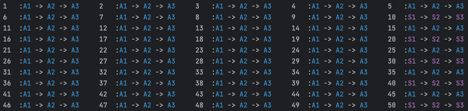

# 透過 Feature Toggle 來安全穩定的發布大規模功能改版
大規模變更（Large-Scale Change, LSC）在軟體開發中常常帶來巨大挑戰。
這種情況需要仔細規劃，以滿足系統穩定性的需求。
隨著 DevOps 理念的迅速演變，流暢無縫的開發、測試和發布這些變更是一件越來越重要的事。
這就是為什麼 Feature Toggle 成為一種寶貴的工具，提供了多種策略來有效地管理、測試和部署大規模變更。

在本文中，我們將主要描述如何利用 Feature Toggle 來安全地開發、測試和發布大規模變更。
從定義 LSC 的概念開始，解釋為何它需要 Feature Toggle 的幫助，以及可以涵蓋哪些類型的 LSC。
接下來，我們將介紹我們將使用的 Feature Toggle 類型，並概述遷移計劃。
最後，我們將展示在開發、測試和發布階段如何處理程式碼和 Feature Toggle 設定，並提供一個簡單的示範。
讓我們開始吧！

## 大規模變更（Large-Scale Change, LSC）

大規模變更指的是在軟體開發中應該在邏輯上是單一個獨立的提交 (commit)，
但由於某些限制（例如合併衝突、測試資源等），最終被拆解成多個獨立提交到程式碼庫的變更。
在專案生命週期中，我們常常會遇到這樣的情況，例如從舊的 API 供應商遷移到新的供應商、
升級已使用的程式庫、淘汰舊的範式並採用新的範式等，這通常被稱為大規模變更。

這些更新通常會對系統產生較大的影響，可能也涉及到系統的關鍵使用者流程（CUJ）。
由於新版本的邏輯、性能和實現細節可能存在一定程度的不確定性，
這可能需要花更多時間進行研究和測試，才能獲得足夠的信心將其部署到正式環境。
或者在最壞的情況下，沒有人敢於進行任何更改。因此，這就是 Feature Toggle 發揮作用的時候。

### 可以覆蓋哪些類型的大規模變更？

首先，我們可以簡單將大規模變更分為兩種類型：邏輯層級和編譯器層級。
主要的區別在於我們是否能夠將兩個版本的程式碼包含在單個可部署的構建專案中。
例如，在 Java Maven 專案中的依賴版本升級屬於編譯器層級的變更（例如從 spring boot 2.6 升級到 spring boot 3.1）。
另一方面，從 Google 地圖 API 遷移到其他地圖 API 供應商的程式碼庫中的使用方式，或者將所有 `String.concat` 改為使用 `StringBuilder`，都屬於邏輯層級的變更。
因此，對於邏輯層級的變更，我們可以應用一些機制，例如使用 Feature Toggle，以幫助使流程更輕鬆且更具信心。
對於編譯器層級的變更，我們現在只能使用一些硬體層面的部署策略（例如藍綠部署、影子部署）來使其更安全。

---

## Feature Toggle 如何幫助大規模變更呢？

根據 MartinFowler.com 上的文章 [Feature Toggles](https://martinfowler.com/articles/feature-toggles.html)，
我們有四種 Toggle 類型：Release、Permission、Ops 和 Experiment。
假設我們需要將所有功能從整合 API 供應商 A 轉移到整合 API 供應商 B，
那麼我們將使用以下三種 Toggle 類型來優化切換 API 供應商的流程。

**Release  Toggle**：<br>
使用 Release Toggle 來確保使用供應商 B 的 API 的程式在所有真實情況下都不會被執行，
即使程式碼已合併到主要分支並部署到正式環境中。


**Permission Toggle**:<br>

同時，透過 Permission Toggle，測試人員可以使用特定使用者（例如測試帳號）來進行測試，
確保整合供應商 B 的 API 的功能能夠正常運作。


**Ops Toggle**:<br>

使用 Ops Toggle 實施金絲雀部署（Canary Release）。確保在所有功能完成後，
首先只對少量真實使用者開放。如果沒有問題，逐步增加使用新功能的使用者比例。


### 遷移與 Toggle 時間表
利用上述的三種 Toggle，我們可以將 API 供應商遷移的流程分為以下幾個階段：
首次 PR 合併、開始測試、開發完成、正式環境測試完成、正式環境穩定以及移除 Toggle 程式碼。
接下來，我們可以啟用/停用 Toggle，以安全地釋出功能遷移。時間表如下：


這些是一些值得注意的關鍵點（假設我們有一個 `fooService`，
它將使用 `vendorAStrategy` 整合供應商 A API，以及 `vendorBStrategy` 整合供應商 B API）：

1. 在合併包含 `vendorBStrategy` 的首個 PR 後，我們應該使用一個 Ops Toggle 來確保所有真實流量都走向 `vendorAStrategy`，並且不會影響任何真實使用者。 
2. 當測試人員想要測試與供應商 B API 整合的功能時，我們應該設置一個 Permission Toggle，讓特定使用者觸發 `vendorBStrategy`。 
3. 對於回歸測試或自動化測試，我們應該添加一個 Permission Toggle，讓第二個使用者始終觸發 `vendorAStrategy`。這可以確保供應商 A 策略運作正常。
4. 當 `vendorBStrategy` 中的所有功能都完成並通過測試後，我們將 Ops Toggle 更改為 Ops Toggle，執行金絲雀部署。 
5. 在正式環境穩定運行後，我們應該清理包含 Toggle 邏輯的程式碼，使程式碼庫保持簡潔。

--- 

## 程式實作與 Demo

在這部分，我們將展示如何實現策略模式來解決多供應商邏輯，並使用 Toggle 來幫助在運行時進行切換執行的策略，
以執行上述的遷移計劃。 （您可以看我針對這次文章的
[GitHub commit](https://github.com/NoahHsu/open-feature-openflagr-example/commit/48e64ba217adc13bae479ee11360ee93f8b5fbae)
來了解更多詳細信息）

### 更改前的程式碼

首先，我們有一個基礎服務名為 `FooService`，該服務將呼叫 `VendorServiceFactory` 以獲取正確的策略，來執行每個步驟的方法。

```java title="FooService.java"
@Service
@RequiredArgsConstructor
public class FooService {

  private final VendorServiceFactory vendorServiceFactory;

  public String step1(RequestModel request) {
    VendorService vendorService = vendorServiceFactory.findTargetVendor(request);
    try {
      return vendorService.step1() + " -> ";
    } catch (Exception e) {
      return "X -> ";
    }
  }
  ... other method (e.g. step2, step3).
}
```


接下來，我們需要介紹介面 `VendorService`，它具有三個方法，分別是 `step1`、`step2` 和 `step3`。

```java title="VendorService.java"
public interface VendorService {

    boolean accept(RequestModel request);

    String step1();

    String step2();

    String step3();

}
```

對於 `VendorServiceFactory`，我們將注入所有實現 `VendorService` 介面的類別。每當我們需要找到目標供應商時，我們將遍歷所有實現，以查看每個 `VendorStrategy` 實現是否能夠處理請求。（注意：當不同策略之間的 `accept` 邏輯存在任何重疊時，列表中的順序變得重要。請參考這篇文章來處理順序問題。）

```java title="VendorServiceFactory.java"
@Service
@RequiredArgsConstructor
public class VendorServiceFactory {

    private final List<VendorService> vendorServices;

    VendorService findTargetVendor(RequestModel request) {
        for (VendorService strategy : vendorServices) {
            if (strategy.accept(request)) {
                return strategy;
            }
        }
        throw new RuntimeException("no match strategy");
    }

}

```

對於 `VendorService` 的實現，我們以 `VendorSV1ServiceImpl` 為例（假設這個實作是用來處理 VIP 使用者）。

```java title="VendorSV1ServiceImpl.java"
@Service
public class VendorSV1ServiceImpl implements VendorService{
    @Override
    public boolean accept(RequestModel request) {
        return request.vendor().isVip();
    }

    @Override
    public String step1() {
        return PURPLE + "S1" + RESET;
    }

    @Override
    public String step2() {
        return PURPLE + "S2" + RESET;
    }

    @Override
    public String step3() {
        return PURPLE + "S3" + RESET;
    }
}
```

而本文的主角是 `VendorAV1ServiceImpl`，在進行任何更改之前，它是這樣的，並且將為 `FooService` 的普通用戶提供服務。

```java title="VendorAV1ServiceImpl.java"
@Service
@RequiredArgsConstructor
public class VendorAV1ServiceImpl implements VendorService {

    private final FeatureToggleApiProvider featureToggleApiProvider;
    
    @Override
    public boolean accept(RequestModel request) {
        return request.vendor().isNormal();
    }

    @Override
    public String step1() {
        return BLUE + "A1" + RESET;
    }

    @Override
    public String step2() {
        return BLUE + "A2" + RESET;
    }

    @Override
    public String step3() {
        return BLUE + "A3" + RESET;
    }

}
```

### 程式改變 & Toggle 設定

在這裡，我們將展示在遷移過程中舊的 `VendorAV1ServiceImpl` 和新策略 `VendorBV1ServiceImpl` 中的代碼更改。它們都為 `FooService` 的「普通」用戶提供服務。讓我們開始吧！

#### 首次 PR 合併

在這個階段，我們首先修改 `VendorAV1ServiceImpl` 的 `accept` 方法如下所示：

```java title="VendorAV1ServiceImpl.java"
public class VendorAV1ServiceImpl implements VendorService {

  private final FeatureToggleApiProvider featureToggleApiProvider;

  @Override
  public boolean accept(RequestModel request) {
    Client client = featureToggleApiProvider.getFlagrApiClient();
    MutableContext evaluationContext = new MutableContext(request.userId());
    evaluationContext.add(USER_ID_KEY, request.userId());

    boolean isToggleOn = client.getBooleanValue(FLAG_KEY, false, evaluationContext);

    return !isToggleOn && request.vendor().isNormal();
  }
  ... // other methods
}
```

同時，我們實現 `VendorBV1ServiceImpl`，與 `VendorAV1ServiceImpl` 相似，只是在 `accept`方法中 當`isToggleOn` 為 `true` 且使用者為 `normal` 時才能使用該策略。在這裡，考慮到該策略中每個步驟的邏輯比較複雜，我們先實現 step1 並釋出此版本至正式環境，如下所示：

```java title="VendorBV1ServiceImpl.java"
@Service
@RequiredArgsConstructor
public class VendorBV1ServiceImpl implements VendorService {

    private final FeatureToggleApiProvider featureToggleApiProvider;

    @Override
    public boolean accept(RequestModel request) {
        Client client = featureToggleApiProvider.getFlagrApiClient();
        MutableContext evaluationContext = new MutableContext(request.userId());
        evaluationContext.add(USER_ID_KEY, request.userId());

        boolean isToggleOn = client.getBooleanValue(FLAG_KEY, false, evaluationContext);

        return isToggleOn && request.vendor().isNormal();
    }

    @Override
    public String step1() {
        return GREEN + "B1" + RESET;
    }

    @Override
    public String step2() {
        throw new UnsupportedOperationException("not implements yes");
    }

    @Override
    public String step3() {
        throw new UnsupportedOperationException("not implements yes");
    }

}
```

同時，我們使用 Toggle 系統（這裡使用了 [OpenFlagr](https://github.com/openflagr/flagr)）設置了一個始終返回關閉狀態的 Toggle。


然後，我們可以讓50個使用者（`id % 10 == 0` 是 VIP 使用者，將會顯示紫色字符串）呼叫 `fooService` 中的所有步驟，而所有普通使用者將使用 `vendorAV1Strategy`，在控制台中顯示藍色字符串。



#### 開始測試

當測試人員想要測試 `VendorBV1ServiceImpl` 是否運作良好時，我們不需要更改任何代碼，只需要添加一個 Permission Toggle，以啟用 `VendorBV1ServiceImpl` 针对某些特定的試驗使用者（例如使用 `userId = 1`）。請注意，這個 Permission Toggle 應該在 Ops Toggle 之前進行評估。


然後我們運行演示程式，我們可以看到對於使用者1，它在控制台上打印了一個綠色的 B1，然後是兩個白色的 X（只有 `step1` 被實作完成了），而其他使用者保持不變。


#### 開發完成
在這個階段，我們將在 `VendorBV1ServiceImpl` 中實現 `step2` 和 `step3`，這樣我們就可以看到使用者1 (`userId = 1`) 完整的綠色字符串。


#### 正式環境測試完成

相同的 Toggle 設置可以在正式環境中的 Toggle 系統上設置，供測試人員進行試驗測試。在這個階段，重要的是要確保真實使用者不會執行 `VendorBV1ServiceImpl` 的方法。對於自動化測試和回歸測試，我們可能也能指定某些使用者始終運行 `VendorAV1ServiceImpl`。


測試完成並修復了錯誤後，我們可以通過移除 Ops Toggle 並將其轉換為 Ops Toggle 來開始金絲雀釋出（它應該在所有 Permission Toggle 之後仍然進行評估）。

#### 正式環境穩定

首先，我們將金絲雀釋出的百分比設置為25%，


如果沒有問題，然後增加到50%，75%，100%。（關於如何通過 Feature Toggle 執行金絲雀釋出的更多詳細信息，可以參考我[之前的文章](https://noahhsu.github.io/DevOps/Easier%2C%20Flexible%2C%20and%20Lower%20Resource%20Cost%20Deployment%20Strategies%20by%20Feature%20Toggle/#canary-release-percentage-based-rollouts))


在保持金絲雀部署的 Ops Toggle 為100%的釋出一段時間後，我們可以說 `VendorBV1ServiceImpl` 已經足夠穩定。

#### 移除 Toggle 程式碼

當 `VendorBV1ServiceImpl` 足夠穩定後，我們可以開始刪除相關的代碼，以保持代碼庫的整潔。首先，我們可以刪除整個 `VendorAV1ServiceImpl.java` 檔案，然後修改 `VendorBV1ServiceImpl` 如下所示：


當這個版本部署到正式環境後，我們也可以在 Toggle 系統中刪除 Toggle 設置。

## 總結
在本文中，我們提出了一個包含三種 Toggle 的遷移時間表，從開發到測試和釋出的管理。最後，我們可以看到 Feature Toggle 在使大規模變更更加輕鬆靈活方面的威力。值得注意的是，一旦功能開發工作完成，我們就不需要更改任何代碼，但仍然可以管理測試和金絲雀釋出的功能執行。

### 參考資料
- [_**Large-Scale Changes**_ from _Software Engineering at Google_, by Lisa Carey, in O'REILLY](https://www.oreilly.com/library/view/software-engineering-at/9781492082781/ch22.html)
- [_**Feature Toggles**_, by Pete Hodgson, in MartinFowler.com](https://martinfowler.com/articles/feature-toggles.html)
- [**_Spring ordered list of beans_**, in stackoverflow](https://stackoverflow.com/questions/16967971/spring-ordered-list-of-beans)