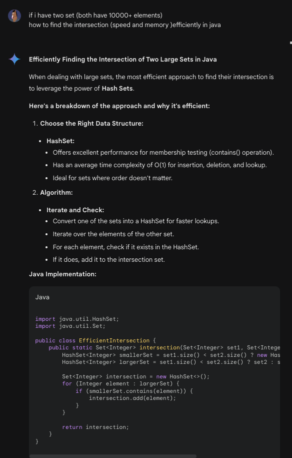
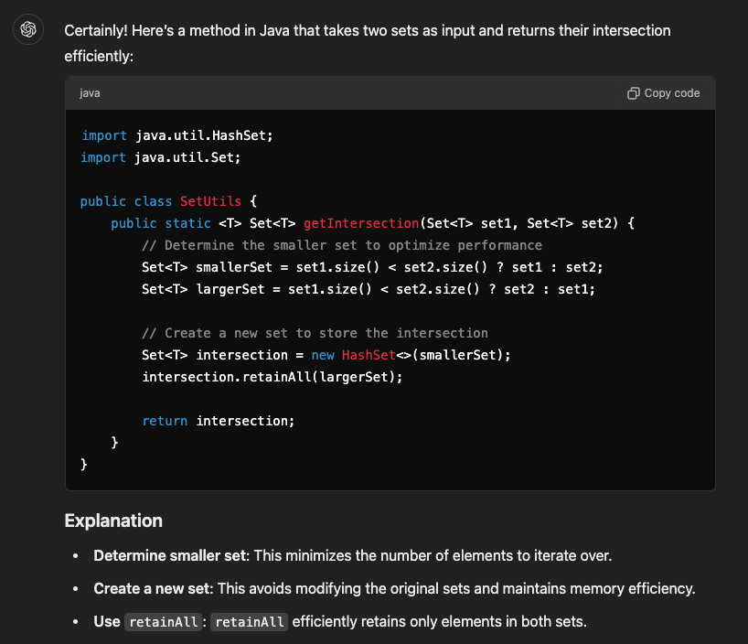
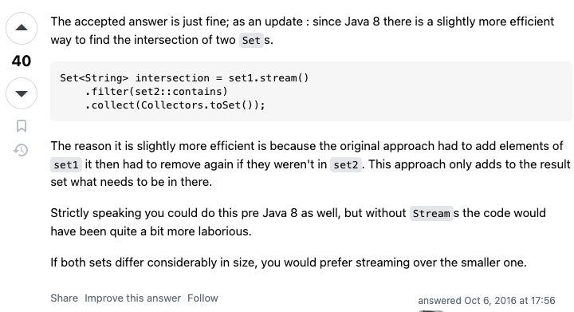
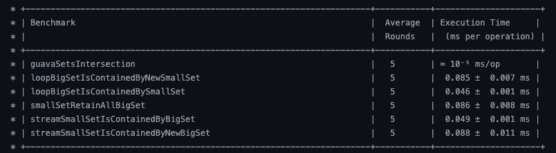
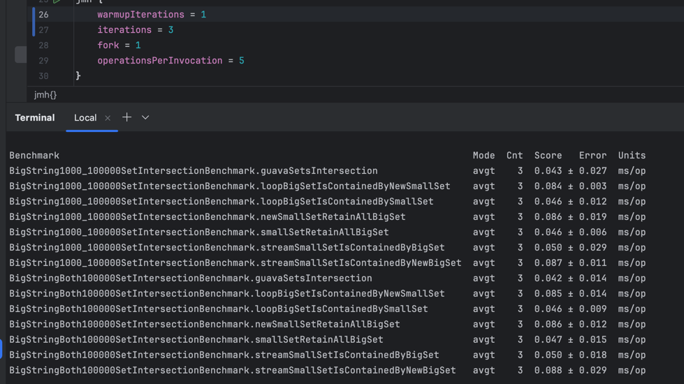
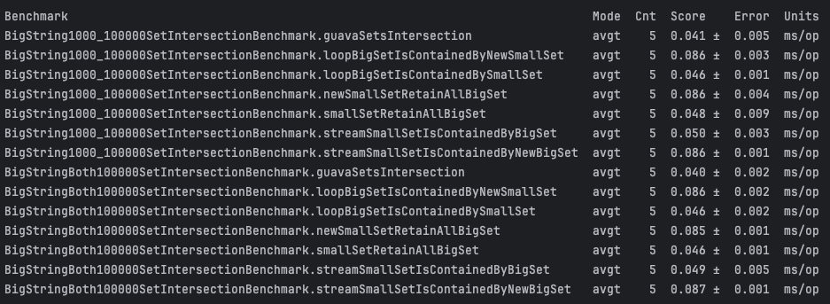

# Comparing Human and AI way for Big-String-Set Intersection Performance in Java by JMH

Recently, I'm facing a case on my job, comparing two set of users and find the intersection as the result. But the difficult part is the number of set is quite big (both set could be 10,000+ elements). To provide a better experiment for our user, the speed can not be too slow. So I want to find a relatively quickly way to do the intersection work. 

In this article, I use AI (gemini, chatGPT) and the 'old-school' way, stackoverflow to find several way to do the set intersection. And Use the JMH [Java Microbenchmark Harness](https://github.com/openjdk/jmh) to run all the test and produce report.

## Candidate Intersection Methods

### Gemini way

First candidate is the Gemini 



Gemini provide a way to loop on the bigger set (create a new `HashSet`), and use the `smallSet.contains()` as an if-condition to decide whether to collect the element as the result.

we now call it the `loopBigSetIsContainedByNewSmallSet`

### Gemini way (human modified)

But The Gemini way, create a new HashMap at the first line. it seems a redundant behavior, so we provide a refined way to not create the new HashSet and call it the `loopBigSetIsContainedBySmallSet`.

### ChatGPT way

The second competitor is ChatGPT (GPT4o).



ChatGpt write a straightforward function that using native java method `Set.retainAll` to do the trick. we call it the `smallSetRetainAllBigSet`.

---

After the AI handout their solution, let try some old-school way to find some answer. Here I found the [question](https://stackoverflow.com/questions/2851938/efficiently-finding-the-intersection-of-a-variable-number-of-sets-of-strings) had been asked 3 years before, In this question, the accepted answer is also using the `Set.retainAll`. but we still get two more way from other answer. Let's take a look.

### Stackoverflow way1: stream.filter

The first human provide answer is to use the Java 8 feature to open a stream() on the small set, and check if each element is contained by the big set 



So we called this the `streamSmallSetIsContainedByBigSet` and another version as `streamSmallSetIsContainedByNewBigSet` to compare with the Gemini way.

### Stackoverflow way2: guava

The final one way is to use the Google provide utils library, [Guava](https://github.com/google/guava). There is a method `intersection()` in the Utils-Class `Sets`. 


## How to test: JMH

We all know that the JVM needs some time (code execution) to warm up for steady performance on methods. Besides, we also need to do performance calculations and produce easy-to-read results. It sounds very troublesome. But luckily, we have Java Microbenchmark Harness (JMH) to do that for us.

### how to use

There are lots of guidance or How-To articles online to do that. I follow the README in [jmh-gradle-plugin](https://github.com/melix/jmh-gradle-plugin) and every thing go well. If you are interested in the detail or code implementation, please refer to [my repository](https://github.com/NoahHsu/performance-benchmark/tree/main/src/jmh/java/org/example/bigset/intersacation), there is a working example.

### scenario description

In my use case, I need to extract user IDs that are present in both of two sets: one representing users who have previously purchased my product, and the other representing users who have agreed to receive advertisements.

To evaluate performance, I designed two scenarios:

1. Both sets contain 100,000 UUIDs, with 1,000 IDs as the intersection.
2. One set contains 100,000 UUIDs, while the other contains 1,100 UUIDs, including the same 1,000 IDs as the intersection. 

## Comparing Result

Here, we can start to execute the JMH command by the [jmh-gradle-plugin](https://github.com/melix/jmh-gradle-plugin). However, there are some essential points that we should be cautious about.

### Be Careful the Lazy Loading Value

Some of the method in Java follow the lazy loading way (e.g. guava's `Sets.intersection()` only return a `SetView` instance until calling some method of that SetView). These kinds of method will be executed extremely quick. while other methods need to take between 0.045 ms ~ 0.085 ms, the lazy loading way cost only around 0.00001 ms.



So we need to add some common method call after it. For example, adding a value assignment from the intersection set helps to trigger the SetView to truly execute the intersection, and we finally get the correct result.

```java
    public static <T> Set<T> getIntersection(Set<T> set1, Set<T> set2) {
        Set<T> answer;
        if (set1.size() <= set2.size()) {
            answer =  Sets.intersection(set1, set2);
        } else {
            answer = Sets.intersection(set2, set1);
        }

        int size = answer.size();

        return answer;
    }
```

### JVM Warm-Up Matters

Next, we take a look on how JVM warm up affect the stability of the result. If only one warm-up once, we will get high errors, which means the result is not stable.


For comparison, if we warm up for three iteration, we can get a more stabilize result with lower error.



## Summary

Check on the final result, the AI generated method in working, but may not be the best solution. We still got some chances to optimize and modify the given answer. Especially for the coding detail like the creation of new instances actually make the time cost twice. So if we can ensure the parameters will be `HashSet` or do it only when they aren't. The performance can be improved. 

Besides, when using JMH, we should always be cautious about the JVM warm up and whether the method return a lazy loading value. Both factor will affect the correctness and deviation of our result.

Finally, in this AI v.s. human combat, the final winner is still human. In both my scenarios, the Google's guava library `Sets.intersection()` outperform the others, takes less than half of the original AI generated methods. 

### Reference

- https://github.com/melix/jmh-gradle-plugin
- https://stackoverflow.com/questions/2851938/efficiently-finding-the-intersection-of-a-variable-number-of-sets-of-strings
- https://gemini.google.com/app
- https://chatgpt.com/