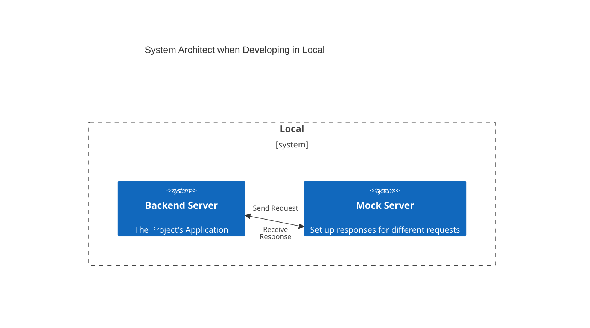
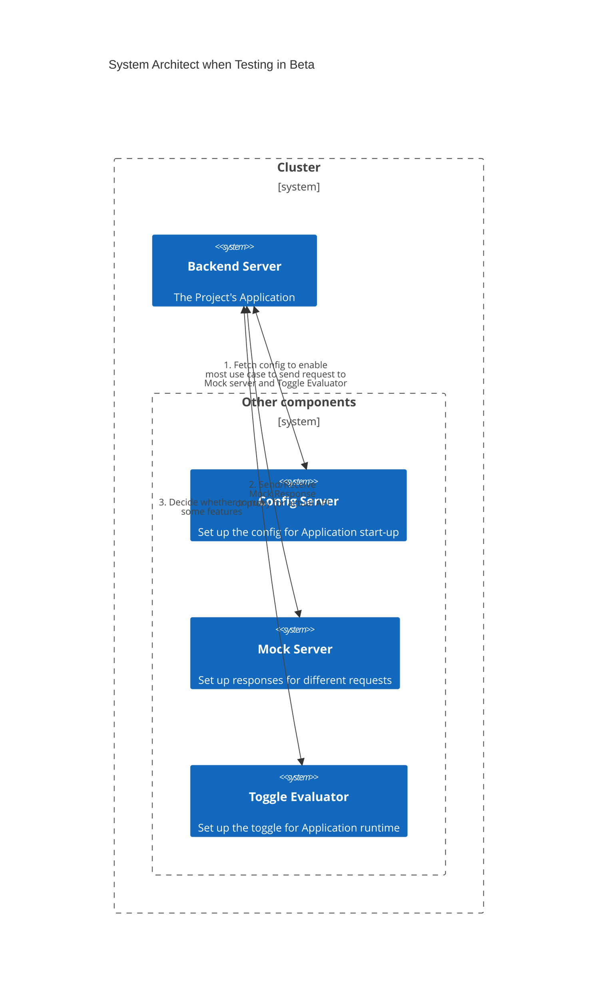
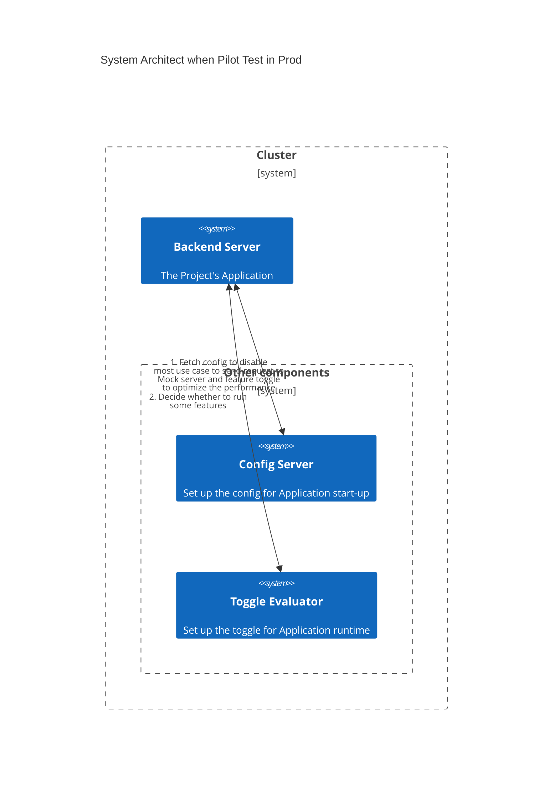

---
date:
  created: 2024-03-31
authors:
  - NoahHsu
categories:
  - DevOps
tags:
  - System Design
  - Devops
  - Trunk-Based
---

# Design an Easy-to-Test, Flexible Application with Config Server, Toggle System, and Mock Server

In the modern software's fast-paced environment, the ability to swiftly adapt to changing requirements and market
demands is the key to success. Achieving this needs the adoption of robust development practices. In this article, we
will dive into how to design an easy-to-test, flexible application using a combination of powerful tools: **Config
Server**, **Toggle System**, and **Mock Server**. When well implemented and applying a decent workflow, these components
can significantly enhance the development lifecycle, enabling teams to build resilient and adaptable software systems.

<!-- more -->

---

## Introduction of Tools

In this section, we will first brief the function of each component

### Config Server

Config Server is an extra server providing config (in the format of .xml, .json, etc.) to the applications. So we can
change the config and then restart the application without committing code and compile. The point is to **save time by
skipping the PR check and the merge-pipeline**.

### Toggle System

Toggle System is usually a bunch of servers that provide both management and evaluation features. We can change the
toggle setting via the management server and when the application calls the evaluation API, it will get the new setting
in the runtime. The main reason to use it is to **change the app's behavior without code change, compile, and restart**.

### Mock Server

Mock Server can be configured to return specific responses for different requests (by path, headers, body...etc.), or be
a proxy server to relay the request to the actual server and return the real response. The intention to use it is to
**mock some special case** (error, timeout...etc.) or **replace some API that does not allow you to put a loading test on it** (
due to cost or other reasons).

---

## Design for Different Situations

With the three components above, we can design the system architecture to demonstrate how to use them to help our work during the development of new features:

### Local/ PR

When we develop in the local environment or run build in a PR-check runner, we can leverage the mock server to help us integrate 3rd-party API, help us make sure we can parse the response correctly, and make sure some mechanism works like our imagination. 

### Beta
After we merge the code and deploy it to the beta environment, we can add the config server and toggle evaluator to make our testing easier.

First, we can set some configs as `on` to make the app always call the mock server and the toggle evaluator (which would slightly slow down the performance, so we need a config to switch this behavior for different situations).

Second, we can easily manipulate the mock server to return every edge-case response (temporary error, timeout, data conflict...) as the spec from 3rd-party API. Also, we could use the conditional proxy mode from the mock server to make some requests called the actual 3rd-party API.

Finally, we could use the feature toggle to decide what version of the feature our Application will execute (e.g. switch two different algorithms to solve parsing document). Or, when testing some frequency limitation logic (e.g. we can only trigger notify 100 times in real product), we can use the toggle to set the limitation to 2 for testers, which can save their time to reach that limitation.

Imagine how much time will be saved for both developers and testers. All of the above flexibility for testing can be done without any code change, PR checking, compilation, or deployment. Only to change the setting via UI and sometimes restart our application to fetch a new config from the config server.

### Load test

Sometimes, we are working on some low-latency-first system. We have to do a load test to show the real performance of our Application. In this case, we are likely facing some issues such as:
1. Some external APIs are not suitable for receiving too many requests due to cost or not only serving us.
2. Some hard-to-produce data need to be prepared (e.g. user data needs to be inserted into auth-server)
3. Some frequency limitations need to be ignored

Fortunately, We have some tools to solve this issue, we definitely can use the mock server to replace the external API that can not put a load test on. Then we can also mock the response dynamically in most mock servers, including custom field values and response latency.

Still, for the limitation logic problem, we use the feature toggle to set a big enough threshold to solve it. But we need to make sure that, the app will not send an extra request to the toggle evaluator. In some cases we only call toggle as a flexible way to make testing easier, it won't happen in the real situation, so we need to use the config server to disable this part to reduce the effect on performance.

### Prod

When everything goes well in the test, we can build the production environment. Basically, we won't need and shouldn't use the Mock server in production, to prevent any unintentional mock results for real user requests.

However, the toggle evaluator is still an essential part of the DevOps process, especially when we adopt trunk-based management. We should use it to hide some code and features that are not ready to go live from being executed. Besides, It can also be used to do some A/B tests and canary releases for some uncertainty in our new feature.

### Pilot Test

Sometimes, we will need to test the full user journey in the real system integrated with 3rd-party API vendors or even some real-world service. It might be a large new feature, e.g. the first time integrating with a new logistic vendor for an e-commerce platform so our tester might need to send a shipment via the system with the new vendor. 

In this case, we would set up a whitelist toggle to allow only our testing accounts to use the new feature while normal users can not use or even see it. 

---

## Summary

In this article, we introduce three components (Config Server, Toggle Evaluator, and Mock Server) to make our development, testing, and maintenance easier and more flexible.
Use config server to save the commit and compile time while we still have some flexibility to control the application's behavior, including whether to call the Mock server and Toggle Evaluator (is related to the tradeoff between performance and flexibility).
Use Toggle System and Mock Server to dynamically decide the behavior of our application or to test some special branch of our code.
Moreover, we gave the use case and system architecture for different situations from local development, PR check, Beta test, Load test, pilot test, and go live on the Production environment.  

### Reference
- Feature Toggles, by Pete Hodgson, in MartinFowler.com
- https://www.mock-server.com/