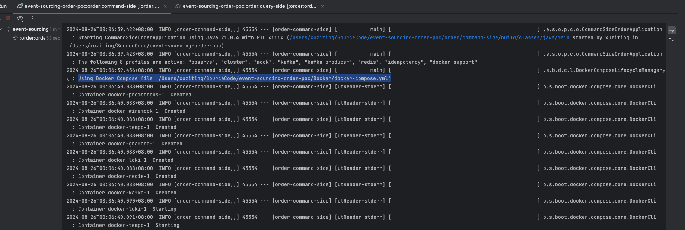
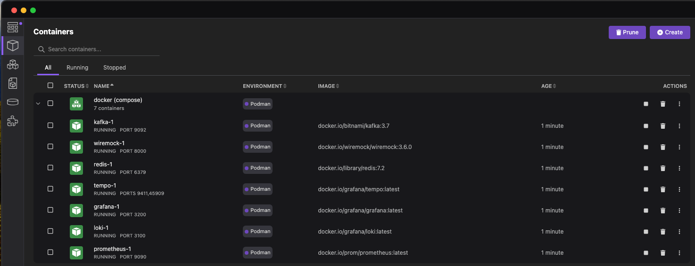

---
date:
created: 2024-08-18
authors:

- NoahHsu
  categories:
- Spring Boot
  tags:
- Java
- Development
- Unit Test
- Integration Test

---

# Spring Boot 3 Support Docker Compose Shows Easy and Consistent on Develop and Test

OutLine:

- As-Is
    - in-dev
        - makefile
        - docker compose
    - in test
        - Test-Container
        - Mock
- little addon setup to make better
    - dev
        - docker profile align to spring profile

        - avoid build in image
    - test
        - active in test
        - shared in different module
- summary advantage
    - no prior knowledge (docker compose or makefile) for develop to run application
    - standalone (not affected by library version supported)
    - test case consistency
    - test speed performance

## As-Is

### In Development

Developers often rely on Docker to create a consistent and reproducible environment when developing Spring Boot
applications. When the number of dependency components grows, two key tools used in this process are Docker Compose and
Makefile.

However, in a multi-module project, each application might need different dependencies. It comes to a difficult
situation.
Every time we need to put [different profiles](https://docs.docker.com/compose/profiles/) with `docker-compose up`, or
wrap it into [different `make` commands](https://makefiletutorial.com/).
Both need extra effort to execute and remember (engineers are extremely lazy).
Don't even mention the integration difficulty in unit tests.

### In Testing

When a test needs to cover the dependency, it first comes up with the mock framework in a programmatic way.
But it turns out to lose so many details because of the lack of real integration. such as

1. The dialect and SQL execution difference between in-memory h2 DB and a real Mysql DB.
2. Provide a mock Java object to make an API Client test lose the coverage of the JSON parsing process.

so some of them start to use the TestContainer technic, to provide a real instance during unit tests. However,
TestContainer suffers from some points too, like:

1. need [support library](https://java.testcontainers.org/modules/databases/mysql/) to gain more interaction.
2. a programmatic way to set up, which is different from the development time (docker-compose way).
3. extra setting to share containers in different tests

## Introducing the Spring-Boot-Docker-Compose

In conclusion, the way of providing dependency containers is not a flawless practice for now. So Spring community
provides a new way to seamlessly integrate with Spring Boot App and docker-compose
called [Spring-Boot-Docker-Compose](https://docs.spring.io/spring-boot/reference/features/dev-services.html#features.dev-services.docker-compose),
follow the starting guide could easily run the app with the dependency container together in one command.

just add the dependency

```groovy
developmentOnly 'org.springframework.boot:spring-boot-docker-compose'
```

then provide a `compose.yaml` file in the root folder can do the trick. If the compose.yaml has a different name or in a
different folder, `spring.docker.compose.file` can solve the problem, refer
to [Using a Specific Compose File](https://docs.spring.io/spring-boot/reference/features/dev-services.html#features.dev-services.docker-compose.specific-file).





From now on, every project member can run the application without manually starting the dependency component container
cluster.

## Little More Setup to Make It Better

To enhance the development and testing experience, consider the following improvements.

### For Development

#### Docker Profile Connected to Spring Profile:

Since the practice of spring profiles is usually used as a dependency management method. For example, we add a
profile `redis` in `spring.profiles.include`, to include `application-redis.yaml`, which contains the related config for
using redis.

So we want to link docker compose profiles to Spring profiles. In this way, developers can ensure that the correct
configuration is used and the corresponding container is up also.

To do that, we need some modification:

1. use comma separate format for `spring.profiles.include`

  ```yaml title="application.yaml"
  spring:
    application:
      name: order-command-side
    profiles:
      include: "observe, cluster, mock, kafka, kafka-producer, redis, idempotency, docker-support"
  ```

2. add profile linking property 'spring.docker.compose.profiles.active'

  ```yaml title="application-docker-support.yaml"
  spring:
    docker:
      compose:
        enabled: true
        profiles:
          active: ${spring.profiles.include}
  ```

3. add profile for each service in compose.yaml

  ```yaml title="compose.yaml"
  version: "3"

  services:
    kafka:
      image: 'bitnami/kafka:3.7'
      profiles: ["kafka", "all"]
      ports:
        - '9092:9092'
      environment:
        - KAFKA_CFG_NODE_ID=0
        - KAFKA_CFG_PROCESS_ROLES=controller,broker
        - KAFKA_CFG_LISTENERS=PLAINTEXT://:9092,CONTROLLER://:9093
        - KAFKA_CFG_LISTENER_SECURITY_PROTOCOL_MAP=CONTROLLER:PLAINTEXT,PLAINTEXT:PLAINTEXT
        - KAFKA_CFG_ADVERTISED_LISTENERS=PLAINTEXT://${KAFKA_HOST:-localhost}:9092
        - KAFKA_CFG_CONTROLLER_QUORUM_VOTERS=0@kafka:9093
        - KAFKA_CFG_CONTROLLER_LISTENER_NAMES=CONTROLLER

    redis:
      image: 'redis:7.2'
      profiles: ["redis", "all"]
      ports:
        - '6379:6379'
  ```

#### Avoid Building in Image:

During development, it's often unnecessary to build a full Docker image for each code change. Instead, developers can
mount the source code directly into the container. This approach speeds up the development process by allowing instant
feedback on code changes without the overhead of rebuilding the image.

### For Testing

#### Activate Docker in Tests:

To fully leverage Docker in tests, it's essential to activate the Docker environment within the test framework. This can
be done by configuring the test setup to spin up necessary Docker containers automatically. This ensures that tests run
in an environment identical to production.

#### Shared Containers Across Modules:

If your application consists of multiple modules, sharing Docker containers across tests can significantly speed up the
testing process. Instead of spinning up a new container for each test module, containers can be shared, reducing the
startup time and resource usage.


## Summary of Advantages

Using Docker in both development and testing environments provides several key benefits:

### No Prior Knowledge Required:

Developers don't need to be experts in Docker Compose or Makefile to get started. The setup can be standardized and
documented, allowing even newcomers to the project to spin up the application quickly.

### Standalone Setup:

The application environment is entirely contained within Docker, meaning it is not affected by the host system's library
versions or configurations. This reduces the "it works on my machine" problem and ensures that the application runs
consistently in any environment.

### Test Case Consistency:

By using Docker for tests, you ensure that all test cases run in a consistent environment. This reduces flakiness and
makes test results more reliable.

### Improved Test Performance:

Sharing Docker containers across test modules and avoiding unnecessary builds can lead to significant performance
improvements. Tests run faster, which speeds up the feedback loop and improves overall productivity.

In conclusion, integrating Docker support into your Spring Boot development and testing workflow offers a streamlined,
consistent, and efficient process that can significantly enhance productivity and reliability. With just a few
additional configurations, you can leverage the full power of Docker to create a development environment that is both
easy to use and highly effective.

### Reference

- https://docs.spring.io/spring-boot/reference/features/dev-services.html#features.dev-services.docker-compose
- wiremock json syntax: [https://wiremock.org/docs/request-matching/](https://wiremock.org/docs/request-matching/)
- wiremock
  docker: [https://github.com/wiremock/wiremock-docker/tree/main](https://github.com/wiremock/wiremock-docker/tree/main)