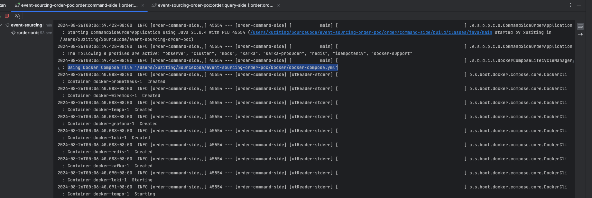
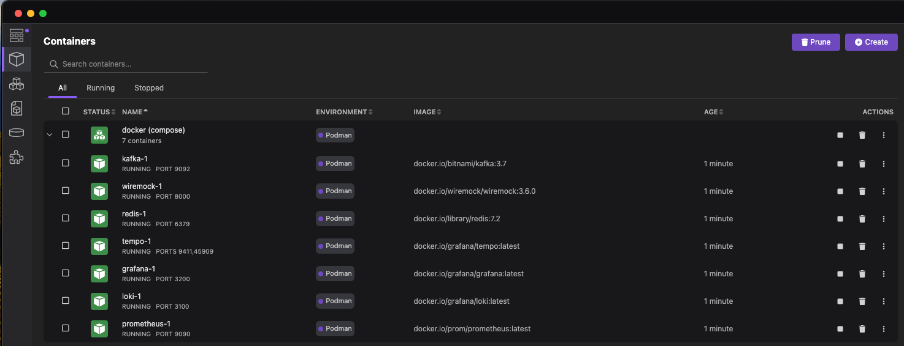
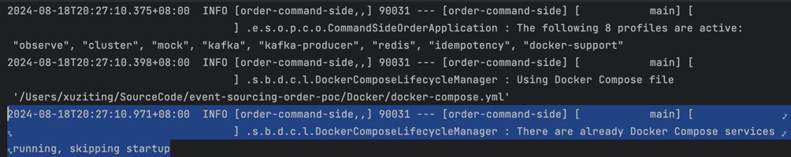

---
date:
  created: 2024-09-01
authors:
  - NoahHsu
categories:
  - Spring Boot
tags:
- Java
  - Development
  - Unit Test
  - Integration Test
  - Docker
---

# Spring Boot 3.1 Docker Compose Support: The Most Intuitive and Consistent Way to Develop and Run Tests with Containers


## As-Is

### In Development

Developers often rely on Docker to create a consistent and reproducible environment when developing Spring Boot
applications. When the number of dependency components grows, two key tools used in this process are Docker Compose and
Makefile.

However, in a multi-module project, each application might need different dependencies. It comes to a difficult
situation.
Every time we need to put [different profiles](https://docs.docker.com/compose/profiles/) with `docker-compose up`, or
wrap it into [different `make` commands](https://makefiletutorial.com/).
Both need extra effort to execute and remember (engineers are extremely lazy).
Don't even mention the integration difficulty in unit tests.

### In Testing

When a test needs to cover the dependency, it first comes up with the mock framework in a programmatic way.
But it turns out to lose so many details because of the lack of real integration. such as

1. The dialect and SQL execution difference between in-memory h2 DB and a real Mysql DB.
2. Provide a mock Java object to make an API Client test lose the coverage of the JSON parsing process.

so some of them start to use the TestContainer technic, to provide a real instance during unit tests. However,
TestContainer suffers from some points too, like:

1. need [support library](https://java.testcontainers.org/modules/databases/mysql/) to gain more interaction.
2. a programmatic way to set up, which is different from the development time (docker-compose way).
3. extra setting to share containers in different tests

## Introducing the Spring-Boot-Docker-Compose

In conclusion, the way of providing dependency containers is not a flawless practice for now. So Spring community
provides a new way to seamlessly integrate with Spring Boot App and docker-compose
called [Spring-Boot-Docker-Compose](https://docs.spring.io/spring-boot/reference/features/dev-services.html#features.dev-services.docker-compose),
follow the starting guide could easily run the app with the dependency container together in one command.

just add the dependency

```groovy
developmentOnly 'org.springframework.boot:spring-boot-docker-compose'
```

then provide a `compose.yaml` file in the root folder can do the trick. If the compose.yaml has a different name or in a
different folder, `spring.docker.compose.file` can solve the problem, refer
to [Using a Specific Compose File](https://docs.spring.io/spring-boot/reference/features/dev-services.html#features.dev-services.docker-compose.specific-file).





From now on, every project member can run the application without manually starting the dependency component container
cluster.

## Little More Setup to Make It Better

To enhance the development and testing experience, consider the following improvements.

### For Development

#### Docker Profile Connected to Spring Profile:

Since the practice of spring profiles is usually used as a dependency management method. For example, we add a
profile `redis` in `spring.profiles.include`, to include `application-redis.yaml`, which contains the related config for
using redis.

So we want to link docker compose profiles to Spring profiles. In this way, developers can ensure that the correct
configuration is used and the corresponding container is up also.

To do that, we need some modification:

1. use comma separate format for `spring.profiles.include`

  ```yaml title="application.yaml"
  spring:
    application:
      name: order-command-side
    profiles:
      include: "observe, cluster, mock, kafka, kafka-producer, redis, idempotency, docker-support"
  ```

2. add profile linking property 'spring.docker.compose.profiles.active'

  ```yaml title="application-docker-support.yaml"
  spring:
    docker:
      compose:
        enabled: true
        profiles:
          active: ${spring.profiles.include}
  ```

3. add profile for each service in compose.yaml

  ```yaml title="compose.yaml"
  version: "3"

  services:
    kafka:
      image: 'bitnami/kafka:3.7'
      profiles: ["kafka", "all"]
      ports:
        - '9092:9092'
      environment:
        - KAFKA_CFG_NODE_ID=0
        - KAFKA_CFG_PROCESS_ROLES=controller,broker
        - KAFKA_CFG_LISTENERS=PLAINTEXT://:9092,CONTROLLER://:9093
        - KAFKA_CFG_LISTENER_SECURITY_PROTOCOL_MAP=CONTROLLER:PLAINTEXT,PLAINTEXT:PLAINTEXT
        - KAFKA_CFG_ADVERTISED_LISTENERS=PLAINTEXT://${KAFKA_HOST:-localhost}:9092
        - KAFKA_CFG_CONTROLLER_QUORUM_VOTERS=0@kafka:9093
        - KAFKA_CFG_CONTROLLER_LISTENER_NAMES=CONTROLLER

    redis:
      image: 'redis:7.2'
      profiles: ["redis", "all"]
      ports:
        - '6379:6379'
  ```

#### Ignore when Building in Image:

[JIB](https://github.com/GoogleContainerTools/jib) is now an out-of-the-box technic of building image for a Spring Boot Application. For now, JIB still include the spring-boot-docker-compose library in the built image (we can track on [this issue](https://github.com/GoogleContainerTools/jib-extensions/issues/158) for new solutions). However, in most cases, we have existed dependency components (e.g. DB service, Redis cluster...) in Test, Staging, or Production environment. So we need to manually exclude it by setting up by jib-layer-filter-extension for [gradle](https://github.com/GoogleContainerTools/jib-extensions/tree/master/first-party/jib-layer-filter-extension-gradle)/[maven](https://github.com/GoogleContainerTools/jib-extensions/tree/master/first-party/jib-layer-filter-extension-maven).

1. add buildscript at the start of root `build.gradle`
  ```yaml
  buildscript {
      dependencies {
          classpath('com.google.cloud.tools:jib-layer-filter-extension-gradle:0.3.0')
      }
  }
  ... other settings
  ```
2. add plugin usage in jib.gradle
  ```groovy
  jib {
    // ... other settings
    pluginExtensions {
        pluginExtension {
            implementation = 'com.google.cloud.tools.jib.gradle.extension.layerfilter.JibLayerFilterExtension'
            configuration {
                filters {
                    filter {
                        glob = '**/spring-boot-docker-compose-*.jar'
                    }
                }
            }
        }
    }
  }
  ```

In this way, the image built by JIB will not include the `spring-boot-docker-compose` library and can run like a normal Spring Boot Application. 

### For Testing

#### Activate Docker in Tests:

In default, the `spring-boot-docker-compose` is disabled when running tests. So we need to activate it by ourselves via property: `spring.docker.compose.skip.in-tests`. Besides, the root folder when running a test is the module folder, so we need to provide the file path to the `root/compose.yaml`. In result, we will write a `test/resources/application.yaml` like:

```yaml
spring:
  docker:
    compose:
      enabled: true
      file: ../../compose.yml  # my test class is in root/modules/client
      skip:
        in-tests: false
      profiles:
        active: ${spring.profiles.include}
```

Then, in our test class, just add the `@SpringBootTest`, so that the docker-compose will trigger by spring boot app.

#### Shared Containers Across Modules:

If your application consists of multiple modules, sharing Docker containers across tests can significantly speed up the
testing process. Instead of spinning up new containers for each test module, containers can be shared, reducing the startup time and resource usage.

If we set the `spring.docker.compose.lifecycle-management` as `start-only` ([reference to document](https://docs.spring.io/spring-boot/reference/features/dev-services.html#features.dev-services.docker-compose.lifecycle)), then the docker cluster will not stop after each test. In the second test, which needs to start the docker-compose, will find the docker cluster is already up and ignore that.



## Summary of Advantages

Using Spring-Boot-Docker-Compose in both development and testing environments provides several key benefits:

### No Prior Knowledge Required:

Developers don't need to know and execute `docker-compose` or `makefile` to run dependency components before running the Spring Boot application. The setup can be standardized and automatic, allowing even newcomers to the project to start the application quickly.

### Decoupling TestContainer Java Library

By using this technic, we can be free from finding the supported TestContainer library for each component, when we need to do extra initialize setup, such as creating schema and data in [Mysql-TestContainer](https://java.testcontainers.org/modules/databases/mysql/), adding mock-rules for [MockServer TestContainer](https://java.testcontainers.org/modules/mockserver/), ...etc. We can use the same setting method as we used in developing.

### Test Case Consistency:

By using Spring-Boot-Docker-Compose for tests, we ensure that all test data are consistent between development and test. Reducing the effort to try to make extra test data in developing features.

### Improved Test Coverage:

In this way, We can easily write some Integration-Test (In a style that the connection didn't go out of one machine, (Otherwise would be called an E2E-Test)) by `@SpringBootTest` (with images of DB, Kafka, Redis, Mock-Server... ). So that the PR-check can provide more confidence than normal Unit-Test.

In conclusion, integrating Spring-Boot-Docker-Compose support into your Spring Boot development and testing offers an intuitive,
consistent, and efficient process that can significantly enhance productivity and reliability. With just a few
additional configurations, you can leverage the full power of Docker to create a development environment that is both easy to use and highly effective.

### Reference

- https://docs.spring.io/spring-boot/reference/features/dev-services.html#features.dev-services.docker-compose
- https://github.com/GoogleContainerTools/jib-extensions/issues/158