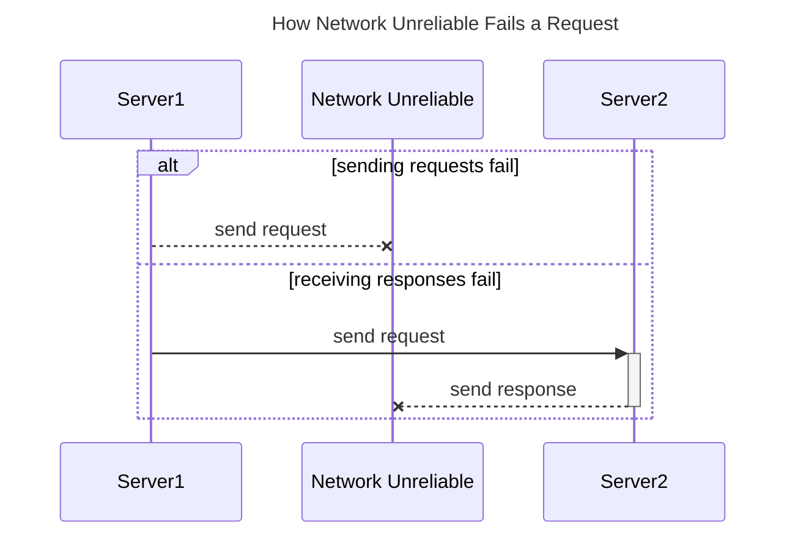
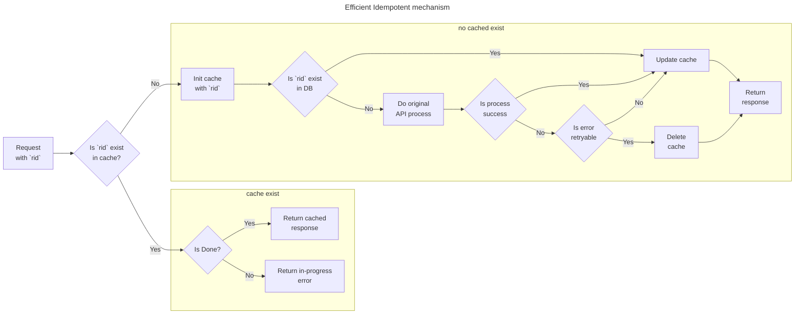

---
tags:
- Idempotent API
- Distributed Systems
- System Design
- Data Consistency
---
# How to design an efficiency Idempotency API

Idempotency API means that the **data/ system state will be the same no matter how many times the API is successfully called** with the same request body/parameter.

For a well-follow-principles RESTful API, besides the POST and PATCH, all other methods are idempotent. But in some particular circumstances (e.g. create a payment, upload files, microservice communication...), it is **essential to implement idempotent if we want to make an API more robust**.

In This article, we will propose an **idempotency mechanism that is also focus on the API performance**. The topics we will cover are as follows:
- Why do we need an API to be idempotent
- How to improve performance
- Propose an efficient idempotency mechanism

---

## Why need Idempotent API

In the software engineering world, we were told that **the network is not always reliable**. The naive solution is to retry when a request fails. But here arises the question: it's not just sending requests that's unreliable; **receiving responses is also unstable**.

As seen in the above picture, two distinct scenarios can result in server1 failing to receive a response. However, the **scenarios are entirely different for the data state in server2**. When the request fails to send, server2 doesn't receive any data, so **the resources aren't created yet**. In this case, it's safe to retry. Conversely, if the issue lies in the response not being correctly sent back to server1, **server2 has already generated the resources**. In such a scenario, retrying without adequate protection is inappropriate.

Engaging in a retry without protection could potentially lead to critical issues, such as double-charging customers, generating duplicate files on the server, or causing data inconsistencies, etc.

Implementing an idempotent API stands as one of the solutions to establish a **safe-retry mechanism, ensuring the provision of a robust API and a resilient system**.

## How to improve performance

A traditional idempotency API solely relies on the database (DB) to verify whether a request has been previously processed, which is an extra workload for the DB that could cause a bad performance for our API. 

Considering the common retry scenarios, they are mostly retries following a request timeout or retries initiated by an asynchronous message consumer, etc. **Most retries tend to occur within a short timeframe**.

Hence, we propose to put an **extra memory cache server** (such as Redis) to help **optimize the mechanism by caching this data**, thereby enhancing its efficiency.

## Efficient Idempotent mechanism

Here is the flow of my proposed mechanism:

In the above mechanism, We have **8 processes and 5 decision points**. Note that this whole **flow should be place after the auth-filter** to prevent unauth request get the cached data. Now, let's delve into each of them individually (P for process; D for Decision):

### Main Flow 
- **P1: Request with `rid`**  
  When invoking the idempotency API, it's essential to supply a unique `request-id` (or `rid`), often a combination of timestamp, user ID, and a random number.
- **D1: Is `rid` exist in cache**  
  The initial server action involves checking for the existence of `rid` in the cache to determine the subsequent flow based on its presence or absence. 

### Subflow1: When the cache does not exist
- **P4: init cache with `rid`**  
  If no cache exists, the first step is to create one with an `is-done` property set to `false`. This operation should occur within the same transaction as D1 to prevent race conditions, possibly using methods like `setIfAbsent` in the Java Redis client or `setnx` in Redis.
- **D3: Is `rid` exist in DB**  
  Then before we really handle the request, we still need to check whether the request is proceeded previously, in order to prevent duplication. 
- **P5: do original API process**  
  In the absence of cache or DB records, the original process should be executed to handle the request.
- **D4: Is process success**  
  Upon handling the request, different reactions are triggered based on the process result. Successful execution leads to cache update and response to the caller. Otherwise, detailed error checking is necessary to decide what to do next.
- **D5: Is error retryable**  
  Proper exception handling is crucial in categorizing errors as retryable or non-retryable. Retryable errors include network errors to the 3rd-party API or other data sources, file systems, etc. Non-retryable errors, such as validation errors, internal-server errors, etc. require code modification or settings adjustment for successful retries.  
- **P6: Update cache**  
  Upon obtaining a definitive result (success or non-retryable error), the cache is updated with the actual response, and setting `is-done` to `true`.
- **P7: Delete cache**  
  For retryable errors, the cache should be deleted, anticipating the handling of retry requests.
- **P8: Return response**  
  Regardless of the process outcome, responding to the caller is essential.

### Subflow2: When cache exist
- **D2: Is Done**  
  Retrieve the cache value and inspect the `is-done` property, which was set or updated during the Subflow1.
- **P2: Return cached response**  
  If the `is-done` properties in the cache is `ture`, indicating a previously completed request, promptly return the cached response.
- **P3: return in-process error**  
  If the `is-done` properties in the cache is `false`, means the request is now being executed, in order to prevent race condition or some other multi-thread issue, we should return an error code to inform the caller about the request is in-progress and advise trying again later.

## Summary
This article introduces an idempotency mechanism that collaborates with a cache server to enhance performance. Here are some crucial points to consider during implementation:

1. **Unique Request Identifier (`rid`)**: 
  Clients must include a rid in their requests, ensuring it's distinctive enough to identify each request uniquely.
2. **Placement after Auth-Filter**: 
   The Idempotency flow should be positioned after the authentication filter for security concern.
3. **Atomic Cache Operations**: 
   Checking for cache existence and creating cache entries should occur atomically to ensure consistency.
4. **DB Integration for Non-existent Cache**: 
   Despite leveraging caching, the mechanism requires a database for existence checks when the cache is absent.
5. **Utilization of Additional Properties**: 
   Incorporate supplementary properties like is-done within cache values to denote the processing status of a request.
6. **Exception Handling Retryability**: 
   Define the retryability of each exception encountered during request handling, aiding in decisions regarding cache updates or deletions.

I will then try to implement this mechanism on my [event-sourcing poc project](https://github.com/NoahHsu/event-sourcing-order-poc/issues/14), see you next time.

### Reference
- [https://restfulapi.net/idempotent-rest-apis/](https://restfulapi.net/idempotent-rest-apis/)
- [https://dev.to/karishmashukla/building-resilient-systems-with-idempotent-apis-5e5p](https://dev.to/karishmashukla/building-resilient-systems-with-idempotent-apis-5e5p)

