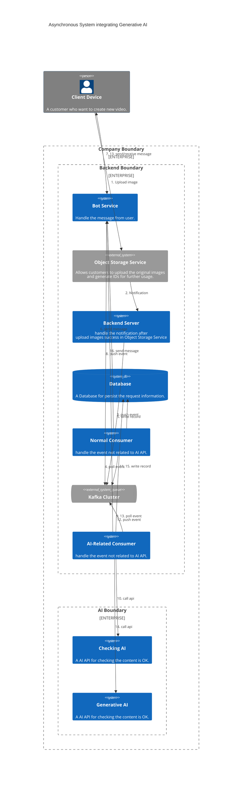

---
tags:
- Kafka
- Distributed Systems
- System Design
---
# 3 Times Performance Improvement for Generative AI within a Kafka Pipeline System

Generative AI went viral in the last year, many use cases show the ability of generative AI, such as text, image, video, music generation, and more. It helps people to create more content with less effort. However, unlike conventional APIs, the Gen-AI API often has a relatively longer latency and higher costs due to the need for better (more expensive) GPU resources to enhance performance.

To ensure a better user experience, it's common to build an asynchronous system using the Kafka pipeline and bot messaging mechanism between the client device (e.g. mobile apps, web apps) and the generative API. This design helps prevent system crashes during peak request times and prevents client timeouts while waiting for responses. However, building such a system requires careful attention to various details, which we will cover in this article. Here is the outline:

1. Asynchronous system integrating generative AI
2. Problems related to high-volume requests
    - The producers unevenly distributed events among Kafka partitions
    - The consumers frequently experienced unnecessary rebalancing and event double-consumption
3. How to solve the problems

---

## Asynchronous System Integrating Generative AI

Let's say we are building a system that provides an AI model for generating slides according to users' original images, style selection, and extra descriptions.

We can draw a system architecture like this:
<!--

-->

Through the architecture above, we can visualize the entire user journey starting from uploading images, selecting a style, and receiving a message containing the final result, potentially in the form of a URL link to the slide.

For each request, the Checking AI requires 0.5 seconds for processing, while the Generative AI needs 3 seconds. Both can concurrently handle up to 64 requests at maximum capacity.

Several design considerations are worth mentioning:

1. We utilize the object storage service's published API to have users directly upload to them instead of an Application built on our own.  
   => Let the professionals do it, and they often provide the notification mechanism, we only need to build an API to receive the `objectID` and other request parameters such as style and description.
2. All APIs (except upload API) won't bring the image in the request body. 
   => This optimization reduces network traffic.
3. The obvious bottlenecks are the Generative AI and the Checking AI, so we place them behind a Kafka queue. 
   => This design ensures that the number of concurrent requests won't cause crashes. Additionally, users receive a response such as 'request received, please wait' before the result is generated.

---

## Problems related to High-Volume of Requests

At first, we constructed a system based on the above architecture, primarily using default settings for both Kafka producer and consumer. The feature test results were satisfactory; however, during the load test, we encountered two significant issues that severely impacted the system's requests per second (RPS) performance:

1. **The producers unevenly distributed events among Kafka partitions.**
2. **The consumers frequently experienced unnecessary rebalancing and event double-consumption.**

### 1. The Producers Unevenly Distributed Events among Kafka Partitions

This situation is related to the [producer's Kafka client partitioner](https://github.com/apache/kafka/blob/trunk/clients/src/main/java/org/apache/kafka/clients/producer/internals/DefaultPartitioner.java), have a glance at its class document below first:

> The default partitioning strategy:
> <ul>
> <li>If a partition is specified in the record, use it
> <li>If no partition is specified but a key is present choose a partition based on a hash of the key
> <li>If no partition or key is present choose the sticky partition that changes when the batch is full.
> See KIP-480 for details about sticky partitioning.

When the batch-send mechanism is enabled using `batch.size` and `linger.ms`, and no key is provided for each event, the default partitioner will assign all the events in the same batch to a single partition (For more details, please refer to [KIP-480](https://cwiki.apache.org/confluence/display/KAFKA/KIP-480%3A+Sticky+Partitioner) and [sticky partitioning](https://github.com/apache/kafka/blob/trunk/clients/src/main/java/org/apache/kafka/clients/producer/internals/StickyPartitionCache.java)).

This issue becomes particularly prominent during peak requests, as numerous requests arrive within a short period. When the message size is too small to reach the batch size, all events within the linger time become jammed in the same partition

This behavior causes a serious uneven workload problem among consumers. We control the number of consumers based on the maximum acceptable concurrent requests of the AI API. Therefore, we cannot afford for some consumers to remain inactive during peak times, as this worsens the bottleneck in the AI API.

### 2. The Consumers Frequently Experienced Unnecessary Rebalancing and Event Double-consumption

This situation is primarily related to the long processing time of the Generative AI API and also involves the heartbeat, polling, and rebalancing mechanism of Kafka consumers. Let's begin by understanding the definitions of heartbeat and rebalance:

> Heartbeats are sent when the consumer polls (i.e., retrieves records) and when it commits records it has consumed.

> If the consumer stops sending heartbeats for long enough, its session will time out and the group coordinator will consider it dead and trigger a rebalance.

(After the [KIP-62](https://cwiki.apache.org/confluence/display/KAFKA/KIP-62%3A+Allow+consumer+to+send+heartbeats+from+a+background+thread), they decouple the heartbeat from the `poll` and `commit offset`, the client will keep sending heartbeats before exceeding the `max.poll.interval.ms`.)

In our scenario, with the default setting of [`session.timeout.ms`](https://kafka.apache.org/documentation/#consumerconfigs_session.timeout.ms), [`max.poll.interval.ms`](https://kafka.apache.org/documentation/#consumerconfigs_max.poll.interval.ms), [`max.poll.records`](https://kafka.apache.org/documentation/#consumerconfigs_max.poll.records), and consumer `ack-mode` set to `Manual` (or `Batch` in default). The flow related to them will look like below:

After the session timeout, the entire consumer group will start to rebalance (for more details, refer to this [article](https://www.verica.io/blog/understanding-kafkas-consumer-group-rebalancing/)), causing consumption to pause temporarily (for a few seconds or even minutes). Moreover, the offsets of handled events cannot be committed to the broker, leading to the re-consumption of these events after rebalancing.

---
## How to solve the problems

While the issues mentioned above may not directly lead to serious business logic problems (an idempotent consumer can also prevent errors caused by double-consuming events), they do slow down the entire pipeline. This slowdown poses a significant challenge when our goal is to deliver more value and provide a better experience to our users.

In the following sections, we'll explore the options available to address these issues.

### Kafka Producer Tuning

We aim to solve the issue of uneven distribution of events to Kafka partitions by adjusting the producer settings. After analyzing the problem, we have identified two potential solutions:

1. **Reducing the `linger.ms` and `batch.size`**:  This makes the producer reduce the number of events sent to a single partition in one batch.
2. **Assigning a unique event key to each event**:  This approach allows the partitioner to distribute events across partitions based on the hash of the key.

While option 1 may result in fewer events per batch and increased network traffic, it's important to note that the sticky partitioning strategy still may push events unevenly since it only ensures that the new batch is not sent to the same partition as the previous one. 

Therefore, we opt for option 2—assigning every event an event key. This ensures that events are aggregated in batches for partitions with the same leader broker.

### Kafka Consumer Tuning

We aim to resolve the issue of consumers frequently rebalancing and double-consuming events by adjusting consumer settings. Upon analyzing the problem, we have listed several solutions to consider:

1. **Increase the Heartbeat**:  We can set the consumer `ack-mode` to `manual-immediate`, `count`, or `time` to commit offsets more frequently for processed events.
2. **Limit the Number of Records in Each Poll**:  We can set a small number for the `max.poll.records` to ensure that we can process all records within the `max.poll.interval.ms`.
3. **Extend Timeout Tolerance**:  We can set a high number for both `max.poll.interval.ms` and `session.timeout.ms` to allow sufficient time for processing all records from one poll.

First, we can remove the option 3. This is a risky adjustment since it can not make sure whether the consumer is actively processing events or is stuck somehow. A longer timeout tolerance could delay recovery when failure did happen.

When it comes to options 1 and 2, I would say they are both acceptable. They both increase the network traffic between the consumer and the broker.

Option 1 involves fetching a large number of records at once and committing offsets frequently. While this may help to slightly lower network traffic, it requires more memory in each consumer, depending on the parameter we set.

On the other hand, option 2 involves fetching a smaller number of records per poll and committing offsets after processing them all. This approach maintains relatively stable network traffic and memory requirements. Therefore, I favor this solution.

---

## Summary

In this article, we propose a pipeline system architecture, which integrates some high-latency Generative AI APIs using Kafka to enhance user experience and stability. Moreover, we bring out the critical point of how to improve the performance of the entire pipeline.

The article focuses on two critical challenges: **achieving even event distribution across partitions** and **preventing unnecessary rebalancing and event double consumption**. To address the former issue, we ensure that every event has its own key, such as a UUID. For the latter problem, we adjust the `max.poll.records`, parameter to a small value, ensuring that records can be processed within the `max.poll.interval.ms`. These adjustments result in a significant improvement in pipeline efficiency, estimated to be around 3 times.

### Reference

Producer:

- [**_DefaultPartitioner.java_**, from Apache, in GitHub](https://github.com/apache/kafka/blob/trunk/clients/src/main/java/org/apache/kafka/clients/producer/internals/DefaultPartitioner.java)
- [**_KIP-480 Sticky Partitioning_**](https://cwiki.apache.org/confluence/display/KAFKA/KIP-480%3A+Sticky+Partitioner)
- [**_StickyPartitionCache.java_**, from Apache, in GitHub](https://github.com/apache/kafka/blob/trunk/clients/src/main/java/org/apache/kafka/clients/producer/internals/StickyPartitionCache.java)

Consumer:

- [**_Chapter 4. Kafka Consumers: Reading Data from Kafka_**, in O'REILLY](https://www.oreilly.com/library/view/kafka-the-definitive/9781491936153/ch04.html)
- [**_difference between max.poll.interval.ms and session.timeout.ms for Kafka_**, in stackoverflow.com](https://stackoverflow.com/questions/39730126/difference-between-session-timeout-ms-and-max-poll-interval-ms-for-kafka-0-10)
- [**_Understanding Kafka’s Consumer Group Rebalancing_**, By Verica, in www.verica.io](https://www.verica.io/blog/understanding-kafkas-consumer-group-rebalancing/)