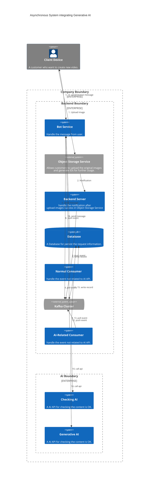

---
tags:
- Kafka
- Distributed Systems
- System Design
---
# Tackle Performance Issues about Generative AI within a Kafka Pipeline System

Generative AI went viral in the last year, many use cases show the ability of generative AI, e.g. text, image, video, music, etc. It helps people to create more content with less effort. But in contrast, the Gen-AI API has a relatively longer latency than normal API, or we can say that it costs more than normal API to improve the performance since the higher price of the better GPU.

So, to maintain a better user experience, it's common to build an asynchronous system using the Kafka pipeline and bot messaging mechanism between the client device (i.e. mobile app, web app) and the generative API. It can avoid the numerous requests in peak time causing the system to crash, or a client timeout for waiting for the response. But there are lots of details we should take care of when building such a system that we will cover in this article and go through the below topic:

1. asynchronous system integrating generative AI
2. problems when high volume requests
3. How to solve the problems

---

## Asynchronous System integrating Generative AI

Let's say we are building a system that provides an AI model for generating slides according to users' original images, style selection, and extra descriptions.

We can draw a system architecture like this:
<!--

-->

Through the architecture above, we can imagine the whole user journey from uploading images, selecting a style, and sending a message that contains the final result (maybe a URL link of the slide) back to users.

For each request, the Checking AI requires 0.5 seconds for processing, while the Generative AI needs 3 seconds. Both can concurrently manage up to 64 requests at maximum capacity.

There are some design thinking worthy of mentioning:
1. We make use of the object storage service published API to have users directly upload to them instead of an Application built on our own.  
   => Let the professionals do it, and they often provide the notification mechanism, we only need to build an API to receive the `objectID` and other request parameters such as style and description.
2. All APIs (except upload API) won't bring the image in the request body. 
   => To cost less on network traffic.
3. The obvious bottlenecks are the Generative AI and then the Checking AI, so we put it behind a Kafka queue. 
   => Make sure the number of concurrency requests won't cause them to crash and the user can get a response like "request received, please wait" before the result is generated.

---

## Problems when High-Volume of Requests

At first, we built a System according to the above architecture, mostly have default settings for both producer and consumer. The feature test result is fine, but when it comes to the load test, we encounter two major problems that cause the RPS of the system to be very poor:

1. **The producer sends event to Kafka partition not evenly distribution.**
2. **The consumers often rebalance and double-consume events.**

### 1. The Producer sends event to Kafka partition not evenly distribution

This situation is related to the [producer's kafka client partitioner](https://github.com/apache/kafka/blob/trunk/clients/src/main/java/org/apache/kafka/clients/producer/internals/DefaultPartitioner.java), have a glance in its class document below first:

> The default partitioning strategy:
> <ul>
> <li>If a partition is specified in the record, use it
> <li>If no partition is specified but a key is present choose a partition based on a hash of the key
> <li>If no partition or key is present choose the sticky partition that changes when the batch is full.
> See KIP-480 for details about sticky partitioning.

So, given we enable the batch-send mechanism by `batch.size` and `linger.ms`. When we don't give a key to each event, then the default partitioner will assign all the events in the same batch to a single partition (please refer to the [KIP-480](https://cwiki.apache.org/confluence/display/KAFKA/KIP-480%3A+Sticky+Partitioner) and [sticky partitioning](https://github.com/apache/kafka/blob/trunk/clients/src/main/java/org/apache/kafka/clients/producer/internals/StickyPartitionCache.java) for more details).

This problem stands out especially when the request is peak, since many requests come in a short period. The message size is too small to reach the batch size, so all events within the linger time would be jammed in the same partition.

This behavior cause serious workload not evenly problem among consumers. Since we control the number of consumers with the maximum acceptable concurrent request of the AI API, we can not afford for some consumers to do nothing during a peak time, which enlarges the AI API bottleneck.

### 2. The Consumers often Rebalance and Double-consume Events.

This situation is caused mainly by the long process time of Generative AI API and is also related to the heartbeat, polling, and rebalancing mechanism of Kafka consumers. Let's get to know the definition of heartbeat and rebalance first:

> Heartbeats are sent when the consumer polls (i.e., retrieves records) and when it commits records it has consumed.

> If the consumer stops sending heartbeats for long enough, its session will time out and the group coordinator will consider it dead and trigger a rebalance.

(After the [KIP-62](https://cwiki.apache.org/confluence/display/KAFKA/KIP-62%3A+Allow+consumer+to+send+heartbeats+from+a+background+thread) they decouple the heartbeat from the `poll` and `commit offset`, the client will keep sending heartbeat before exceeding the `max.poll.interval.ms`.)

In our case, with the default setting of [`session.timeout.ms`](https://kafka.apache.org/documentation/#consumerconfigs_session.timeout.ms), [`max.poll.interval.ms`](https://kafka.apache.org/documentation/#consumerconfigs_max.poll.interval.ms), [`max.poll.records`](https://kafka.apache.org/documentation/#consumerconfigs_max.poll.records), and consumer `ack-mode` is `Manual` (or `Batch` in default). The flow related to them will look like below:

After the session timeout, the whole consumer group will start to rebalance (please refer to this article for more details), causing the consumption to stop for a period (a couple of seconds or even minutes). What is even worse is that the handled events offset can not be committed to the broker, so after rebalanced, those events will be consumed again.

---
## How to solve the problems

All problems mentioned above won't cause serious business logic problems (an idempotency consumer can also prevent errors when double consuming events), but slow down the whole pipeline, which is a huge problem when we want to bring our users more value and a good experience.

Here, we will see what option we've got to solve the above problems.

### Kafka Producer Tuning

We aim to solve the "The producer sends event to Kafka partition not evenly distribution" problem by tuning the producer. According to the problem analysis, there are two options:

1. **Reducing the `linger.ms` and `batch.size`**:  To make the producer not put too many events into a single partition in one batch.
2. **Give every event an event key**:  To make the partitioner choose a partition based on the hash of the key.

Consider option 1,  this may cause the batch to contain fewer events and increase the network traffic. Besides, the sticky strategy only guarantees not to send the new batch to the same partition as the last batch.

So we choose option 2, **giving every event an event key**. The events are aggregated in batches for the partitions which have the same leader broker.

### Kafka Consumer Tuning

We aim to solve the "The consumers often rebalance and double-consume events" problem by tuning the consumer. According to the problem analysis, we have different aspects to adjust the setting:

1. **Increase the Heartbeat**: We can set the consumer `ack-mode` to manual-immediate or other similar to commit offset every time an event is processed.
2. **Fewer Records in one Poll**: We can set a small number for the `max.poll.records`, and make sure we can finish them within the `max.poll.interval.ms`
3. **Longer Tolerance of Timeout**: We can set a high number for both `max.poll.interval.ms` and `session.timeout.ms` to have enough time to process all records from one poll.

Here, we can remove the option 3 first. This is a risky adjustment since we can not make sure whether the consumer is really processing the event or it's stuck somehow. The longer timeout tolerance means the later recovery will start when failure did happen.

When it comes to options 1 and 2, I would say they are both acceptable. They both increase the network traffic between the consumer and the broker.

In option 1, get back a lot of records one time, and commit offset many times. The network traffic might be slightly less but needs more memory in each consumer.

In option 2, get much fewer records one time and commit offset after all of them are processed. The network traffic and memory requirements are relatively stable. So I prefer this solution more. 

---

## Summary

In this article, we propose a pipeline system architecture, which integrates some high-latency Generative AI API using Kafka to bring a stable and good user experience. Especially, we bring out the critical point of how to improve the performance of the whole pipeline.

The two critical points are "how to evenly produce events to each partition" and "how to prevent unnecessary rebalance and events being double consumed. We only make sure every event has its own key (maybe a UUID) for the former problem. For the second problem, we set a small number for the `max.poll.records`, and make sure we can finish them within the `max.poll.interval.ms`. After all those adjustments, the pipeline efficiency can be improved around 3 times.

### Reference
Producer:
- [**_DefaultPartitioner.java_**, from Apache, in GitHub](https://github.com/apache/kafka/blob/trunk/clients/src/main/java/org/apache/kafka/clients/producer/internals/DefaultPartitioner.java)
- [**_KIP-480 Sticky Partitioning_**](https://cwiki.apache.org/confluence/display/KAFKA/KIP-480%3A+Sticky+Partitioner)
- [**_StickyPartitionCache.java_**, from Apache, in GitHub](https://github.com/apache/kafka/blob/trunk/clients/src/main/java/org/apache/kafka/clients/producer/internals/StickyPartitionCache.java)

Consumer:
- [**_Chapter 4. Kafka Consumers: Reading Data from Kafka_**, in O'REILLY](https://www.oreilly.com/library/view/kafka-the-definitive/9781491936153/ch04.html)
- [**_difference between max.poll.interval.ms and session.timeout.ms for kafka_**, in stackoverflow](https://stackoverflow.com/questions/39730126/difference-between-session-timeout-ms-and-max-poll-interval-ms-for-kafka-0-10)
- [**_Understanding Kafka’s Consumer Group Rebalancing_**, By Verica, in www.verica.io](https://www.verica.io/blog/understanding-kafkas-consumer-group-rebalancing/)