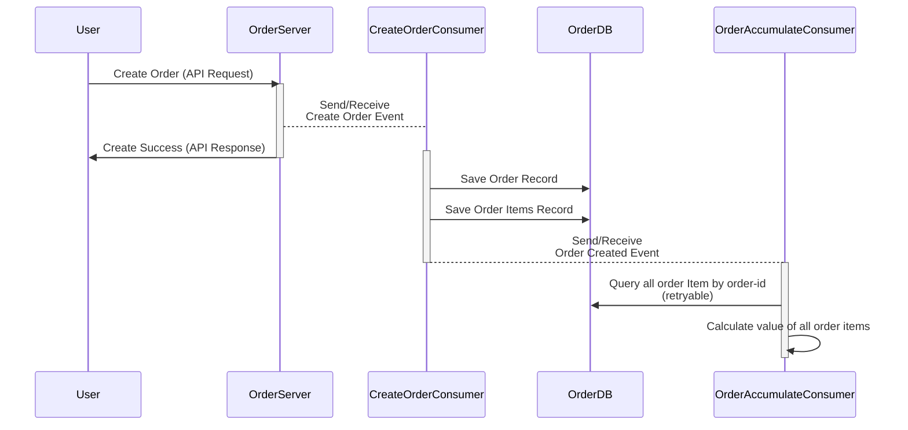
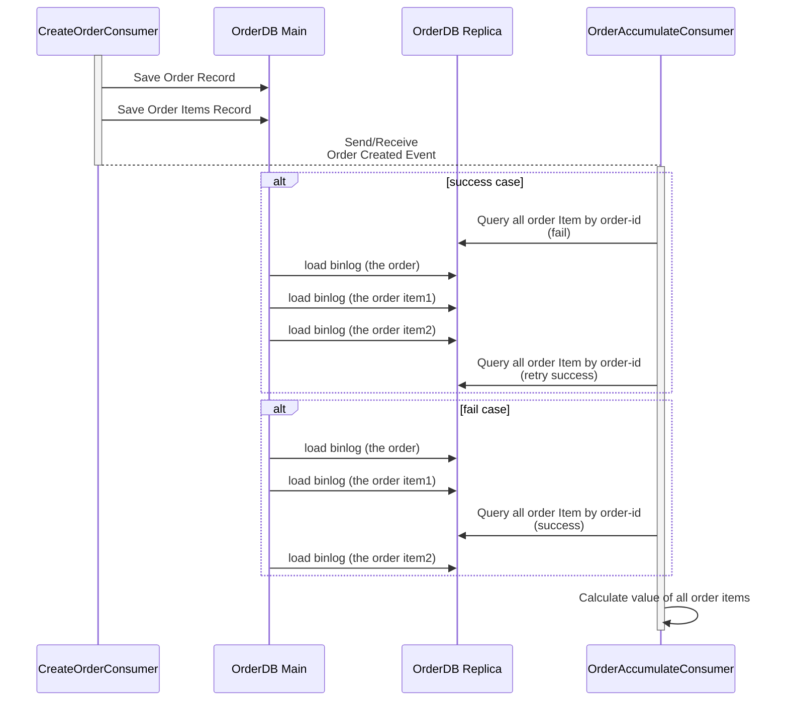

# Mysql Trap when DB Read-Write Separate and Parent-Child Relationship Schema without Transaction 
DB replicas are essential for data-intensive systems. First, we can accelerate our performance by writing to the master and reading from replicas, which can have many instances or be geographically close to users. Second, the replica DB can serve as a backup for the system. No matter what happens to the main DB, it can be a data recovery source or even become the new main DB to reduce downtime.

It's no secret that the trade-off for using a read-write separation mechanism is so-called "data inconsistency." The solutions to avoid this situation depend on the use cases and the architecture. In this article, we will go through the MySQL binlog mechanism and what would happen if we don't use transaction when insert/update parent-child relationship data. Let's start!

## How Replica Sync Data from Main DB
In MySQL 8.x, the replica DB syncs data from the main DB by reading the "binary log," which we call a "binlog." The content of the "binlog" can be set in two formats: row-based and statement-based. Since some nondeterministic statements (those that depend on a loadable function or stored program, LIMIT without an ORDER BY, etc.; see more details on [statement-based replication disadvantages]((https://dev.mysql.com/doc/refman/8.0/en/replication-sbr-rbr.html#replication-sbr-rbr-sbr-disadvantages))) are not suitable for statement-based replication, the default format is row-based ([ref.](https://dev.mysql.com/doc/refman/8.0/en/binary-log-setting.html)).

In the row-based replication, it will acquire a table lock first, and then apply the affected rows (update or insert) within the transaction (if exist) in batch mode (more detail in [row-based replication process](https://dev.mysql.com/doc/refman/8.4/en/replication-rbr-usage.html)).

As a result, if we don't use transaction on multiple insert statements to the same table, the "binlog" will add multiple  separate logs, one for each record. The replica DB then reads the logs one by one. After we understand how MySQL replicas sync data, let's take a look on which use cases might fail under this mechanism.

## Use Case that Fall into Trap

Given that we are an e-commerce platform providing a create order feature to the user, one order may contain many items, which we call order items. This data should be saved into the DB and used to calculate for data analysis and financial requirements. To handle the peak loading during campaigns, we designed the system with an asynchronous update mechanism as shown in the diagram below:  

When we apply DB replication to increase the performance and robustness of this process, we direct the OrderAccumulateConsumer queries to the replica DB while inserting data into the main DB from the CreateOrderConsumer. We are aware that the data might not be consistent at some points in time, so we add a retry mechanism for the query step if the order doesn't exist.

We thought this would solve all problems perfectly. Unfortunately, there is still one case that might go wrong. Let's zoom in on the interaction between the two consumers and DBs:

As we can see, a problematic situation may occur when the replica DB loads the binlog halfway (if we insert data without a transaction initially). The OrderAccumulateConsumer might only retrieve one order item, which will not trigger a retry query, resulting in an incorrect calculation.

## How to Avoid Incomplete Read from Replicas

To avoid this situation, insert all child records within a transaction, ensuring they are not saved separately. If including all insert statements in a transaction is difficult, add an extra field in the parent table to denote the expected number of child records. Modify the retry logic to check if the query result matches this value.

## Sumarry
In this article, we first provide a brief overview of how the MySQL replica DB syncs data from the main DB. Then, we introduce a scenario that could cause an incorrect result if a query occurs during partial replication due to non-transactional statement execution.

Finally, we discuss how to avoid this error by adding transactions to queries or by adding an extra field to enhance the retry logic.
Thank you for reading. Wish you have a nice consistent data system.

### Reference
read-after-write inconsistency: [https://avikdas.com/2020/04/13/scalability-concepts-read-after-write-consistency.html](https://avikdas.com/2020/04/13/scalability-concepts-read-after-write-consistency.html)
replicas binlog format: [https://dev.mysql.com/doc/refman/8.0/en/replication-formats.html](https://dev.mysql.com/doc/refman/8.0/en/replication-formats.html)
pros-and-cons of each format: [https://dev.mysql.com/doc/refman/8.0/en/replication-sbr-rbr.html](https://dev.mysql.com/doc/refman/8.0/en/replication-sbr-rbr.html)
row-based replication process: [https://dev.mysql.com/doc/refman/8.4/en/replication-rbr-usage.html](https://dev.mysql.com/doc/refman/8.4/en/replication-rbr-usage.html)